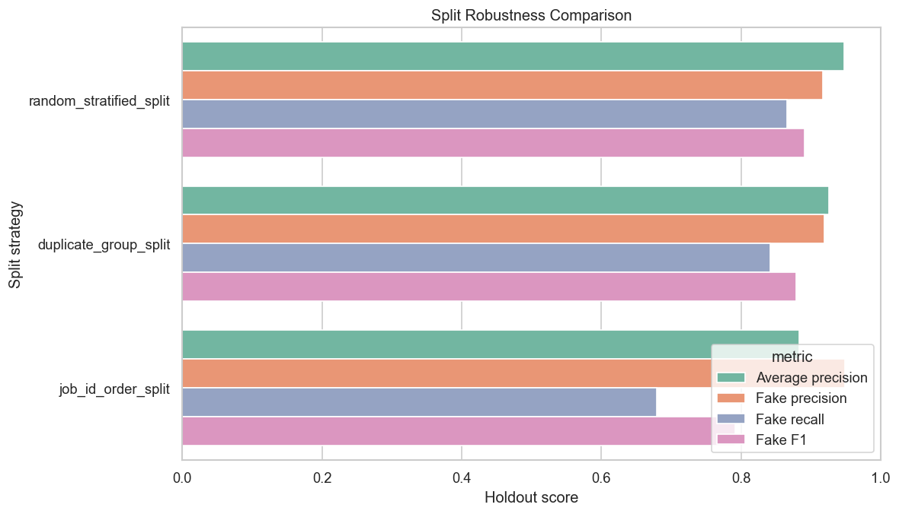
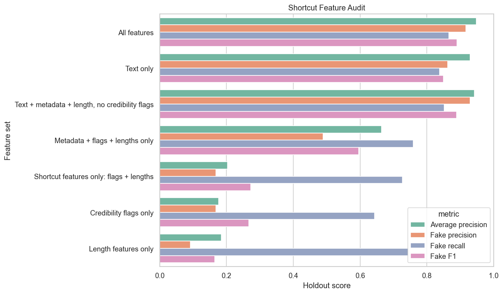
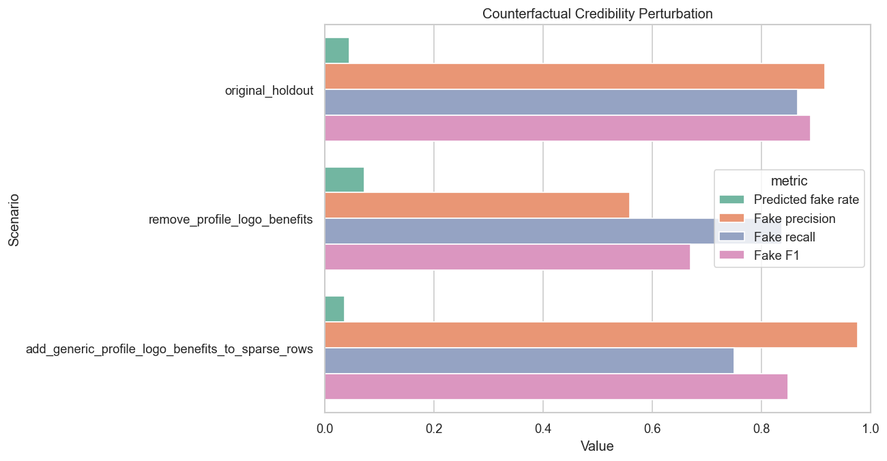
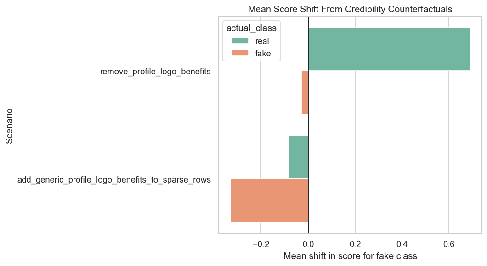
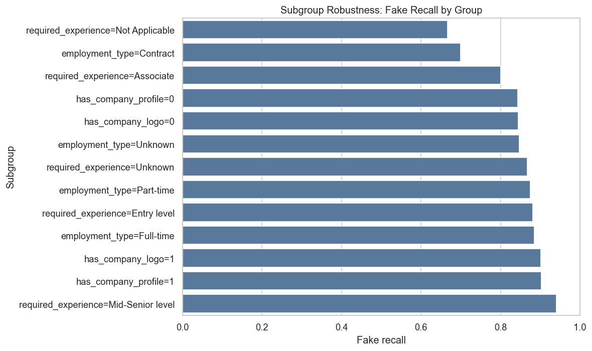

# Artifact, Leakage, and Robustness Audit Report

## Research Question

The earlier project versions showed that fake job postings can be classified with strong performance. This audit asks a more critical question:

**Is the model detecting general fraud patterns, or is performance partly explained by dataset artifacts, duplicate leakage, missing-information shortcuts, and unstable evaluation splits?**

This is a stronger research angle because it tests whether the model's success is trustworthy.

## Audit Outputs

Code:

- [artifact_robustness_audit.py](artifact_robustness_audit.py)

Tables:

- [artifact_audit_outputs/tables](artifact_audit_outputs/tables)

Figures:

- [artifact_audit_outputs/figures](artifact_audit_outputs/figures)

## Main Finding

The model is not only using shallow shortcut features, but it is meaningfully sensitive to credibility-related metadata such as company profile, company logo, and benefits information.

The strongest audit conclusion is:

**High model performance is partly robust, but the model's behavior changes when duplicate leakage is controlled, job posting order is respected, and credibility metadata is counterfactually changed.**

This means the model should be interpreted as a strong dataset classifier, not as proven real-world fraud detection.

## Connection to Prior Future Work

This audit is motivated by future-work directions in prior online recruitment fraud research.

Vidros et al. introduced EMSCAD and called for richer future analysis using user behavior, company and network data, user-content-IP collision patterns, and graph modeling. This project cannot add unavailable user/network data, but it does audit repeated content, company credibility metadata, and split robustness.

Vo et al. focused on the class imbalance problem and pointed toward improved imbalance handling and evolving data settings. This project extends that direction through threshold sensitivity, cost sensitivity, prevalence stress testing, review-budget analysis, training-distribution comparison, label scarcity, and job-id-order splitting.

Mahbub, Pardede, and Kayes emphasized contextual features and localization. This project responds by testing whether company credibility metadata affects predictions and by showing that missing company information can create false positives.

Adebayo et al. moved beyond binary classification toward fraudulent job types and noted the need for richer data. This project does not annotate fraud types, but it shows that binary EMSCAD performance should be interpreted cautiously.

Alghamdi and Alharby emphasized attributes such as company profile, company logo, and required experience. This project directly tests the sensitivity of predictions to company profile, logo, and benefits information.

Full related-work mapping: [related_work_and_research_gap.md](related_work_and_research_gap.md)

## 1. Duplicate Leakage Audit

Table: [duplicate_signature_summary.csv](artifact_audit_outputs/tables/duplicate_signature_summary.csv)

Exact content signatures were created from normalized title, company profile, description, requirements, and benefits text.

| Measure | Value |
|---|---:|
| Rows | 17,880 |
| Unique content signatures | 15,872 |
| Duplicate signature groups | 747 |
| Rows in duplicate groups | 2,755 |
| Largest duplicate group | 375 |
| Mixed-label duplicate groups | 0 |
| Fake rate among duplicate rows | 0.0701 |

Interpretation: the dataset contains repeated or near-identical postings under this exact content signature definition. There are 2,755 rows in duplicate groups, which is about 15.4% of the dataset. The largest duplicate group contains 375 rows.

There are no mixed-label duplicate groups, meaning exact duplicate signatures do not appear with both real and fake labels. That reduces one kind of label inconsistency, but it also means repeated postings can make random train-test splits easier because a model may see nearly identical content during training.

## 2. Random Split Leakage Check

Table: [random_split_duplicate_leakage_summary.csv](artifact_audit_outputs/tables/random_split_duplicate_leakage_summary.csv)

| Measure | Value |
|---|---:|
| Overlapping content signatures between train and test | 359 |
| Test rows with duplicate signature in training | 617 |
| Share of test rows with duplicate signature in training | 0.1380 |

Interpretation: in the random stratified split, 13.8% of test rows have an exact content duplicate in the training set. This is a meaningful leakage risk. It does not prove that the model is only memorizing duplicates, but it means the random split is not a clean test of performance on unseen posting content.

## 3. Split Robustness Comparison

Table: [split_robustness_comparison.csv](artifact_audit_outputs/tables/split_robustness_comparison.csv)

Figure:

| Split Strategy | Test Fake Rate | Average Precision | Fake Precision | Fake Recall | Fake F1 | FP | FN |
|---|---:|---:|---:|---:|---:|---:|---:|
| Random stratified split | 0.0483 | 0.9475 | 0.9167 | 0.8657 | 0.8905 | 17 | 29 |
| Duplicate group split | 0.0482 | 0.9256 | 0.9188 | 0.8419 | 0.8786 | 16 | 34 |
| Job ID order split | 0.0794 | 0.8829 | 0.9488 | 0.6789 | 0.7915 | 13 | 114 |

Interpretation: controlling exact duplicate leakage causes a modest performance drop. Fake F1 falls from 0.8905 to 0.8786, and average precision falls from 0.9475 to 0.9256. This suggests duplicate leakage contributes to optimistic evaluation, but it does not fully explain the model's performance.

The job ID order split causes a much larger change. Fake recall falls from 0.8657 to 0.6789, and fake F1 falls from 0.8905 to 0.7915. The test fake rate is also higher in the later job ID segment, rising to 7.94%. This suggests that random splitting may hide distribution shift across the dataset order.

The split audit supports a nuanced conclusion:

- The model remains strong under a duplicate-group split.
- The model is less stable under an order-based split.
- Random split results likely overstate deployment-style performance.

## 4. Shortcut Feature Audit

Table: [shortcut_feature_audit.csv](artifact_audit_outputs/tables/shortcut_feature_audit.csv)

Figure:

| Feature Set | Average Precision | Fake Precision | Fake Recall | Fake F1 | Predicted Fake Rate | FP | FN |
|---|---:|---:|---:|---:|---:|---:|---:|
| All features | 0.9475 | 0.9167 | 0.8657 | 0.8905 | 0.0456 | 17 | 29 |
| Text only | 0.9289 | 0.8619 | 0.8380 | 0.8498 | 0.0470 | 29 | 35 |
| Text + metadata + length, no credibility flags | 0.9415 | 0.9293 | 0.8519 | 0.8889 | 0.0443 | 14 | 32 |
| Metadata + flags + lengths only | 0.6642 | 0.4896 | 0.7593 | 0.5953 | 0.0749 | 171 | 52 |
| Shortcut features only: flags + lengths | 0.2036 | 0.1677 | 0.7269 | 0.2726 | 0.2094 | 779 | 59 |
| Credibility flags only | 0.1760 | 0.1683 | 0.6435 | 0.2668 | 0.1848 | 687 | 77 |
| Length features only | 0.1841 | 0.0923 | 0.7454 | 0.1643 | 0.3902 | 1,583 | 55 |

Interpretation: shortcut features alone do not explain the full model performance. The flags-and-lengths-only model has low fake precision and creates 779 false positives. The length-only model is especially unstable, predicting 39.02% of postings as fake and creating 1,583 false positives.

Text is the strongest feature source. The text-only model reaches fake F1 of 0.8498, while the all-feature model reaches 0.8905.

The no-credibility-flags model performs almost as well as the all-feature model, with fake F1 of 0.8889. This suggests the model is not dependent on company logo/profile flags alone.

However, this does not mean credibility metadata is irrelevant. The counterfactual audit below shows that changing credibility information still has a large effect on model behavior.

## 5. Counterfactual Credibility Test

Tables:

- [counterfactual_credibility_test.csv](artifact_audit_outputs/tables/counterfactual_credibility_test.csv)
- [counterfactual_credibility_score_shifts.csv](artifact_audit_outputs/tables/counterfactual_credibility_score_shifts.csv)

Figures:

This test changes credibility-related information while keeping the same trained model.

| Scenario | Average Precision | Fake Precision | Fake Recall | Fake F1 | Predicted Fake Rate | FP | FN |
|---|---:|---:|---:|---:|---:|---:|---:|
| Original holdout | 0.9475 | 0.9167 | 0.8657 | 0.8905 | 0.0456 | 17 | 29 |
| Remove profile, logo, and benefits | 0.8411 | 0.5586 | 0.8380 | 0.6704 | 0.0725 | 143 | 35 |
| Add generic profile, logo, and benefits to sparse rows | 0.9350 | 0.9759 | 0.7500 | 0.8482 | 0.0371 | 4 | 54 |

Interpretation: this is the most important audit result.

When company profile, company logo, and benefits information are removed, false positives increase from 17 to 143. Fake precision drops from 0.9167 to 0.5586. This means many real postings become more likely to be classified as fake when credibility information is removed.

When generic credibility information is added to sparse rows, false positives fall from 17 to 4, but false negatives rise from 29 to 54. Fake recall drops from 0.8657 to 0.7500. This means some fake postings become easier for the model to miss when they are made to look more complete.

Score shifts show the same pattern:

| Scenario | Actual Class | Mean Score Shift | Predicted Fake Rate |
|---|---|---:|---:|
| Remove profile, logo, and benefits | Real | +0.6885 | 0.0336 |
| Remove profile, logo, and benefits | Fake | -0.0277 | 0.8380 |
| Add generic credibility to sparse rows | Real | -0.0829 | 0.0009 |
| Add generic credibility to sparse rows | Fake | -0.3304 | 0.7500 |

The model score moves real postings toward the fake class when credibility information is removed. It also moves fake postings toward the real class when generic credibility information is added.

Conclusion: the model is not merely a shortcut model, but credibility metadata strongly affects its decisions.

## 6. Subgroup Robustness

Table: [subgroup_robustness_metrics.csv](artifact_audit_outputs/tables/subgroup_robustness_metrics.csv)

Figure:

Important subgroup results:

| Subgroup | Fake Rate | Fake Precision | Fake Recall | False Positive Rate Among Real |
|---|---:|---:|---:|---:|
| has_company_profile = 0 | 0.1675 | 0.8828 | 0.8433 | 0.0225 |
| has_company_profile = 1 | 0.0223 | 0.9737 | 0.9024 | 0.0006 |
| has_company_logo = 0 | 0.1529 | 0.8906 | 0.8444 | 0.0187 |
| has_company_logo = 1 | 0.0226 | 0.9605 | 0.9012 | 0.0009 |
| employment_type = Contract | 0.0260 | 0.6364 | 0.7000 | 0.0107 |
| employment_type = Full-time | 0.0450 | 0.9583 | 0.8846 | 0.0018 |

Interpretation: model behavior is not uniform across subgroups.

Rows without company profile or company logo have much higher fake rates, but also higher false positive rates among real postings. This aligns with the counterfactual test: missing credibility information is a meaningful model signal, but it can also create false positives for legitimate sparse postings.

The contract subgroup has lower recall and lower precision than full-time postings, though it has fewer fake examples. This should be interpreted as a possible instability rather than a final claim about contract jobs.

## 7. Error Case Study Exports

Tables:

- [top_false_positive_case_studies.csv](artifact_audit_outputs/tables/top_false_positive_case_studies.csv)
- [top_false_negative_case_studies.csv](artifact_audit_outputs/tables/top_false_negative_case_studies.csv)

The exported case-study tables provide examples for manual review.

False positives are real postings that the model scored as fake. These are useful for identifying legitimate postings that look suspicious because they have sparse company information, short profiles, missing benefits, or other incomplete metadata.

False negatives are fake postings that the model scored as real. These are useful for identifying fake postings that appear more complete or use language similar to legitimate postings.

## Stronger Project Claim

This audit produces a more interesting project claim:

**The classifier performs well on the dataset, but its apparent success is partly sensitive to duplicate content, split strategy, and credibility metadata. The model is not only learning shallow shortcuts, but missing or generic company information meaningfully changes its predictions.**

That claim is stronger than "Linear SVM performs best" because it evaluates whether the model's success is trustworthy.

## Final Interpretation

The audit does not invalidate the classifier. Instead, it clarifies what kind of evidence the classifier provides.

Supported conclusions:

1. The model has real signal beyond shortcut features.
2. Exact duplicate leakage exists in the random split.
3. Duplicate-group splitting reduces performance modestly.
4. Job ID order splitting reduces recall substantially.
5. Missing credibility metadata strongly increases fake scores for real postings.
6. Adding generic credibility information reduces fake scores for fake postings.
7. Sparse legitimate postings are a major false-positive risk.

The project should therefore be framed as an **artifact and robustness audit of fake job detection under class imbalance**, not just a model-building exercise.

## Limitations

- The duplicate signature is exact after text normalization, not semantic near-duplicate detection.
- The job ID order split is a proxy for distribution shift, not a confirmed time-based split.
- Counterfactual edits are synthetic and simplified.
- Subgroup findings are descriptive and depend on subgroup sample sizes.
- The analysis uses classic machine learning models rather than modern language models.

These limitations are useful because they define the next step: stronger external validation would require a newer dataset, temporal labels, or manually verified deployment data.
