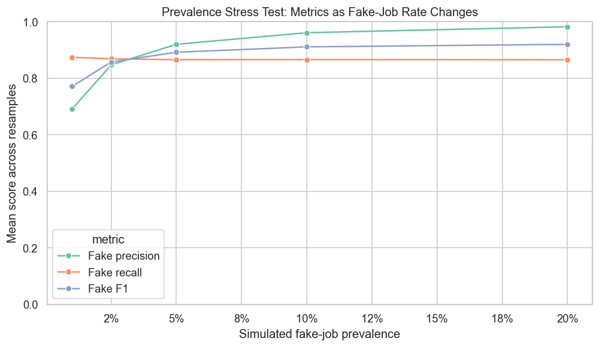
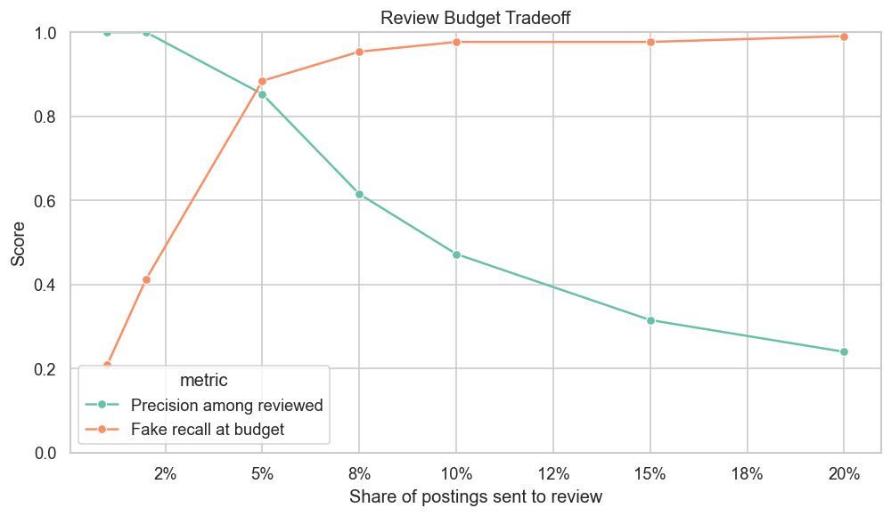
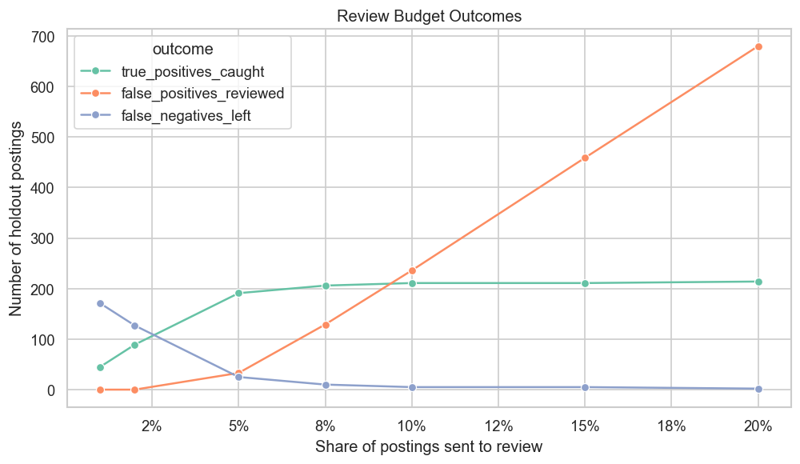
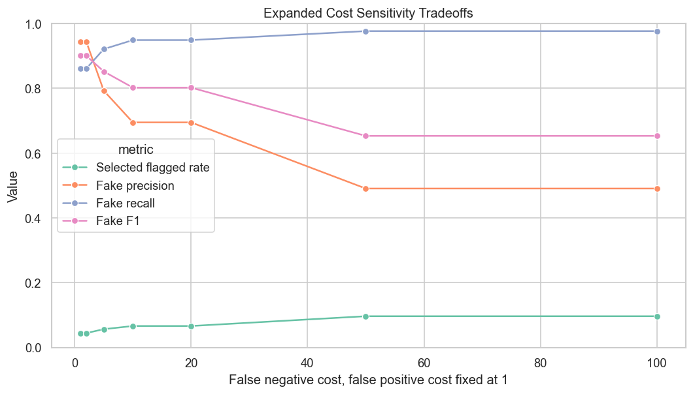
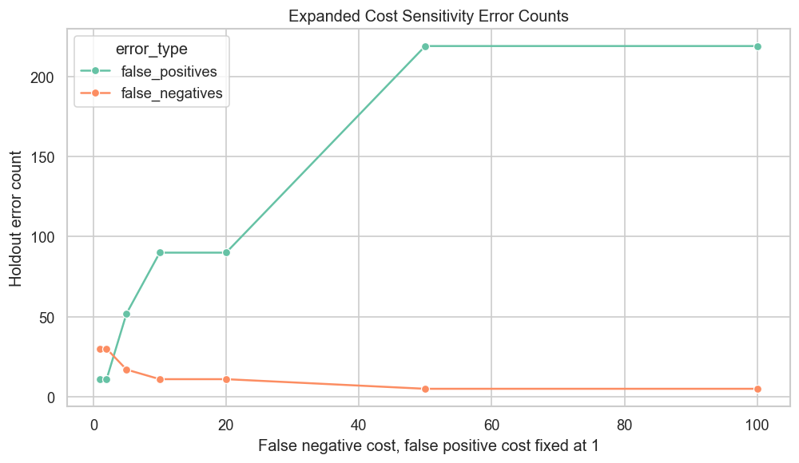
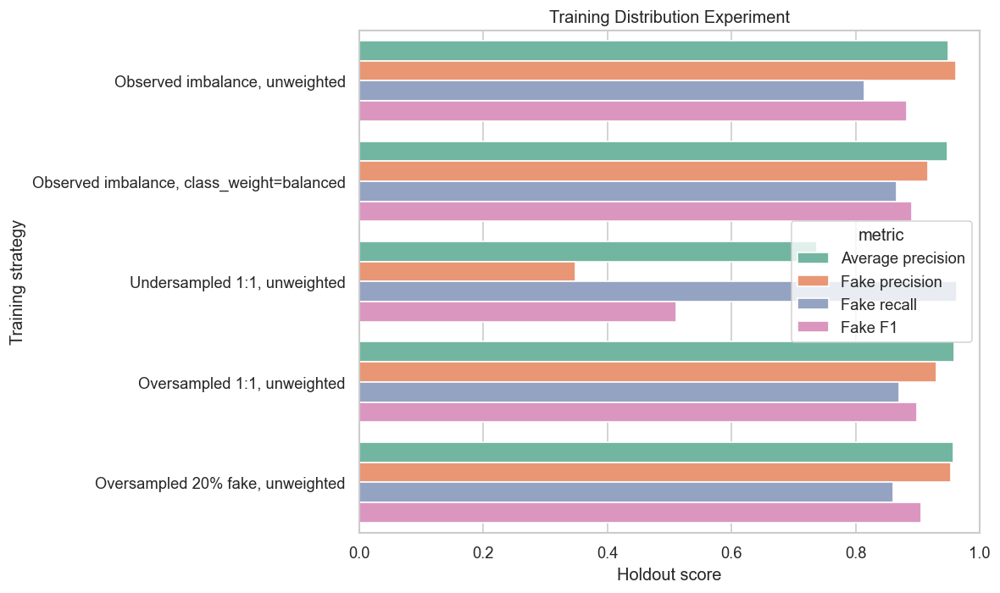
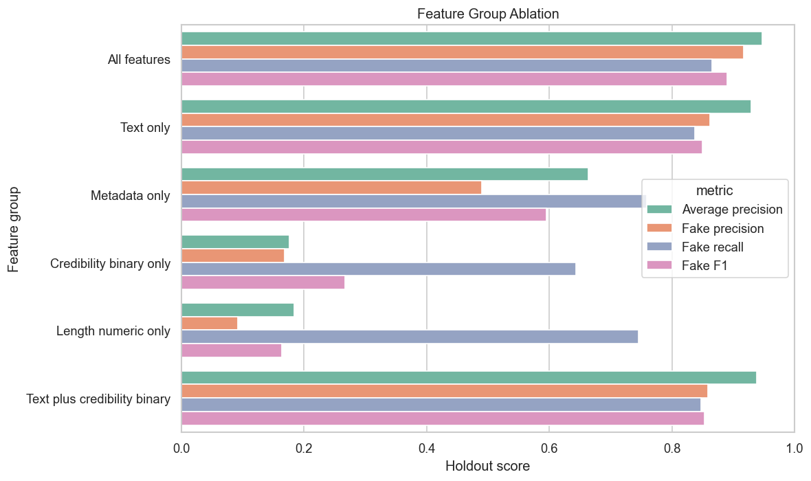
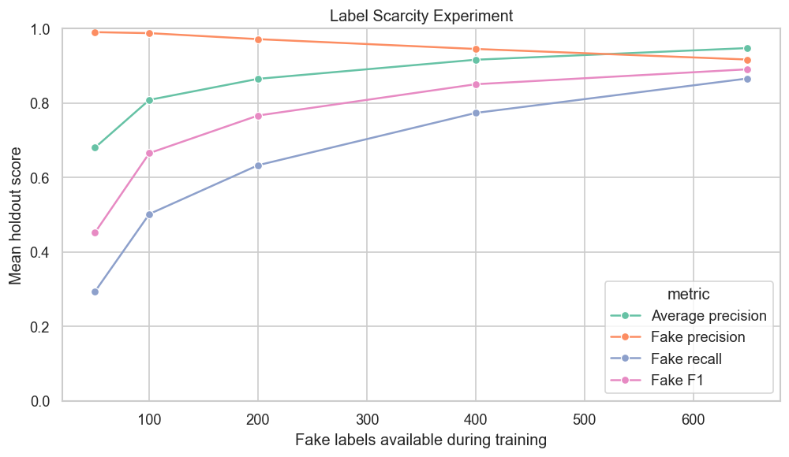
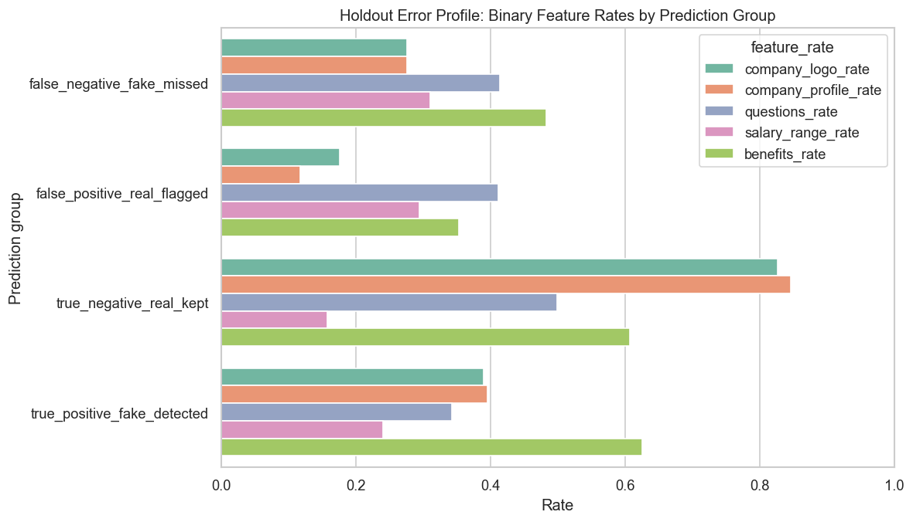

# Comprehensive Imbalance Experiment Report

## Research Angle

The original project asked whether classic machine learning models can classify fake job postings. This extension asks a more specific imbalance-focused question:

**How stable are fake job detection results when the fake-job base rate, review capacity, error-cost assumptions, training distribution, label availability, and feature groups change?**

This framing treats fake job detection as a rare-event decision problem. The goal is not only to maximize a model score, but to understand when a model's apparent usefulness changes.

## Experimental Setup

The expanded experiments use the cleaned dataset:

- Total rows: 17,880
- Real postings: 17,014
- Fake postings: 866
- Fake-posting rate: 4.84%

The experiment runner uses a stratified 75/25 train-test split. The main holdout model is a balanced Linear SVM trained with:

- TF-IDF text features from title, company profile, description, requirements, and benefits
- Categorical metadata
- Binary credibility and presence flags
- Text length and word count features

The holdout split keeps the original class imbalance.

Output files:

- Notebook: [imbalance_focused_research.ipynb](imbalance_focused_research.ipynb)
- Experiment code: [comprehensive_imbalance_experiments.py](comprehensive_imbalance_experiments.py)
- Tables: [imbalance_research_outputs/tables](imbalance_research_outputs/tables)
- Figures: [imbalance_research_outputs/figures](imbalance_research_outputs/figures)

## Selected Holdout Model

Table: [selected_model_holdout_metrics.csv](imbalance_research_outputs/tables/selected_model_holdout_metrics.csv)

| Model | Accuracy | Balanced Accuracy | ROC AUC | Average Precision | Fake Precision | Fake Recall | Fake F1 | Predicted Fake Rate | TP | FP | FN | TN |
|---|---:|---:|---:|---:|---:|---:|---:|---:|---:|---:|---:|---:|
| Linear SVM balanced full features | 0.9897 | 0.9309 | 0.9903 | 0.9475 | 0.9167 | 0.8657 | 0.8905 | 0.0456 | 187 | 17 | 29 | 4,237 |

Interpretation: the selected model performs strongly on the holdout split. It detects 187 of 216 fake postings and misses 29. It incorrectly flags 17 real postings as fake. The predicted fake rate is 4.56%, close to the true fake rate in the holdout set.

This is the reference model for the controlled experiments below.

## Experiment 1: Prevalence Stress Test

Table: [prevalence_stress_test_summary.csv](imbalance_research_outputs/tables/prevalence_stress_test_summary.csv)

Figure:



This experiment holds the trained model fixed and resamples the holdout predictions to simulate different fake-job base rates.

| Simulated Fake Rate | Fake Precision | Fake Recall | Fake F1 | Mean Predicted Fake Rate | Mean FP | Mean FN |
|---:|---:|---:|---:|---:|---:|---:|
| 1.0% | 0.6908 | 0.8742 | 0.7708 | 0.0127 | 11.81 | 3.78 |
| 2.5% | 0.8470 | 0.8685 | 0.8573 | 0.0256 | 11.79 | 9.87 |
| 5.0% | 0.9199 | 0.8655 | 0.8918 | 0.0470 | 11.33 | 20.18 |
| 10.0% | 0.9609 | 0.8658 | 0.9108 | 0.0901 | 10.58 | 40.25 |
| 20.0% | 0.9819 | 0.8651 | 0.9198 | 0.1762 | 9.55 | 80.93 |

Interpretation: recall stays relatively stable because recall measures the share of actual fake postings detected. Precision changes much more because precision depends on the base rate of fake postings in the evaluated population.

At a simulated 1% fake-job rate, fake precision is 0.6908. At a simulated 20% fake-job rate, fake precision is 0.9819. The trained model did not change. The evaluation population changed.

This is one of the strongest findings in the project. It shows that a fake-job detector's apparent usefulness depends on the prevalence of fake postings in the environment where it is evaluated or deployed. A model that appears highly precise when fake postings are more common can be less precise when fake postings are very rare.

## Experiment 2: Review Budget Analysis

Table: [review_budget_analysis.csv](imbalance_research_outputs/tables/review_budget_analysis.csv)

Figures:





This experiment ranks holdout postings by model score and asks what happens if only the highest-risk postings are reviewed.

| Review Budget | Reviewed Count | Fake Caught | Real Incorrectly Reviewed | Fake Left Uncaught | Precision Among Reviewed | Fake Recall at Budget |
|---:|---:|---:|---:|---:|---:|---:|
| 1.0% | 45 | 45 | 0 | 171 | 1.0000 | 0.2083 |
| 2.0% | 89 | 89 | 0 | 127 | 1.0000 | 0.4120 |
| 5.0% | 224 | 191 | 33 | 25 | 0.8527 | 0.8843 |
| 7.5% | 335 | 206 | 129 | 10 | 0.6149 | 0.9537 |
| 10.0% | 447 | 211 | 236 | 5 | 0.4720 | 0.9769 |
| 15.0% | 670 | 211 | 459 | 5 | 0.3149 | 0.9769 |
| 20.0% | 894 | 214 | 680 | 2 | 0.2394 | 0.9907 |

Interpretation: the highest-risk postings are highly concentrated near the top of the ranking. Reviewing the top 2% of postings catches 41.2% of fake postings with no false positives in this holdout split. Reviewing the top 5% catches 88.4% of fake postings, but 33 real postings are also sent to review.

After the top 5% to 7.5%, the tradeoff changes. Recall keeps increasing, but precision drops sharply because many additional reviewed postings are real. This is expected in an imbalanced dataset because real postings greatly outnumber fake postings.

This analysis is more realistic than a single threshold because many real systems have review capacity limits.

## Experiment 3: Expanded Cost Sensitivity

Table: [expanded_cost_sensitivity_threshold_selection.csv](imbalance_research_outputs/tables/expanded_cost_sensitivity_threshold_selection.csv)

Figures:





The cost calculation is:

```text
total cost = false positives + (false negatives * false negative cost)
```

The false positive cost is fixed at 1. The false negative cost is varied.

| FP Cost | FN Cost | Selected Threshold | Selected Flagged Rate | FP | FN | Fake Precision | Fake Recall | Fake F1 | Total Cost |
|---:|---:|---:|---:|---:|---:|---:|---:|---:|---:|
| 1 | 1 | 0.0697 | 0.0441 | 11 | 30 | 0.9442 | 0.8611 | 0.9007 | 41 |
| 1 | 2 | 0.0697 | 0.0441 | 11 | 30 | 0.9442 | 0.8611 | 0.9007 | 71 |
| 1 | 5 | -0.2287 | 0.0562 | 52 | 17 | 0.7928 | 0.9213 | 0.8522 | 137 |
| 1 | 10 | -0.4407 | 0.0660 | 90 | 11 | 0.6949 | 0.9491 | 0.8023 | 200 |
| 1 | 20 | -0.4407 | 0.0660 | 90 | 11 | 0.6949 | 0.9491 | 0.8023 | 310 |
| 1 | 50 | -0.7259 | 0.0962 | 219 | 5 | 0.4907 | 0.9769 | 0.6533 | 469 |
| 1 | 100 | -0.7259 | 0.0962 | 219 | 5 | 0.4907 | 0.9769 | 0.6533 | 719 |

Interpretation: when false positives and false negatives have similar cost, the selected threshold is conservative. It flags 4.41% of postings, produces 11 false positives, and misses 30 fake postings.

When false negatives become more costly, the selected threshold moves downward. A lower threshold flags more postings as fake. This reduces false negatives but increases false positives.

At a false negative cost of 50, the selected threshold flags 9.62% of postings. False negatives fall to 5, but false positives rise to 219. Fake recall becomes 0.9769, while fake precision drops to 0.4907.

This analysis shows that the "best" threshold depends on the assumed cost of each error type.

## Experiment 4: Training Distribution Experiment

Table: [training_distribution_experiment.csv](imbalance_research_outputs/tables/training_distribution_experiment.csv)

Figure:



| Training Strategy | Training Fake Rate | Average Precision | Fake Precision | Fake Recall | Fake F1 | Predicted Fake Rate | FP | FN |
|---|---:|---:|---:|---:|---:|---:|---:|---:|
| Observed imbalance, unweighted | 0.0485 | 0.9499 | 0.9617 | 0.8148 | 0.8822 | 0.0409 | 7 | 40 |
| Observed imbalance, class_weight=balanced | 0.0485 | 0.9475 | 0.9167 | 0.8657 | 0.8905 | 0.0456 | 17 | 29 |
| Undersampled 1:1, unweighted | 0.5000 | 0.7375 | 0.3484 | 0.9630 | 0.5117 | 0.1336 | 389 | 8 |
| Oversampled 1:1, unweighted | 0.5000 | 0.9593 | 0.9307 | 0.8704 | 0.8995 | 0.0452 | 14 | 28 |
| Oversampled 20% fake, unweighted | 0.2000 | 0.9579 | 0.9538 | 0.8611 | 0.9051 | 0.0436 | 9 | 30 |

Interpretation: balancing the training data does not automatically improve the model. The undersampled 1:1 model has very high fake recall, but it produces 389 false positives and much lower precision. Removing many real postings during undersampling likely removes useful information about the majority class.

Oversampling performs better in this experiment. The oversampled 20% fake model has the highest fake F1 at 0.9051, while the oversampled 1:1 model has the highest average precision at 0.9593. The unweighted observed-imbalance model is more conservative, with high precision but lower recall.

This supports a useful conclusion: imbalance handling is itself a modeling choice. Different balancing strategies shift the precision-recall tradeoff in different ways.

## Experiment 5: Feature Group Ablation

Table: [feature_group_ablation.csv](imbalance_research_outputs/tables/feature_group_ablation.csv)

Figure:



| Feature Group | Average Precision | Fake Precision | Fake Recall | Fake F1 | Predicted Fake Rate | FP | FN |
|---|---:|---:|---:|---:|---:|---:|---:|
| All features | 0.9475 | 0.9167 | 0.8657 | 0.8905 | 0.0456 | 17 | 29 |
| Text only | 0.9289 | 0.8619 | 0.8380 | 0.8498 | 0.0470 | 29 | 35 |
| Metadata only | 0.6642 | 0.4896 | 0.7593 | 0.5953 | 0.0749 | 171 | 52 |
| Credibility binary only | 0.1760 | 0.1683 | 0.6435 | 0.2668 | 0.1848 | 687 | 77 |
| Length numeric only | 0.1841 | 0.0923 | 0.7454 | 0.1643 | 0.3902 | 1,583 | 55 |
| Text plus credibility binary | 0.9380 | 0.8592 | 0.8472 | 0.8531 | 0.0477 | 30 | 33 |

Interpretation: text features carry most of the useful signal. The text-only model performs much better than metadata-only, credibility-only, or length-only models.

Credibility and length features alone produce many false positives. For example, the length-only model predicts 39.02% of postings as fake and creates 1,583 false positives. This means that short or sparse postings alone are not enough to classify fake jobs reliably.

The all-feature model performs best overall. This suggests that metadata and credibility signals are useful when combined with text, but risky when used alone.

## Experiment 6: Label Scarcity

Table: [label_scarcity_experiment_summary.csv](imbalance_research_outputs/tables/label_scarcity_experiment_summary.csv)

Figure:



| Fake Labels Available | Average Precision | Fake Precision | Fake Recall | Fake F1 | Mean FP | Mean FN |
|---:|---:|---:|---:|---:|---:|---:|
| 50 | 0.6799 | 0.9903 | 0.2932 | 0.4516 | 0.67 | 152.67 |
| 100 | 0.8083 | 0.9876 | 0.5015 | 0.6652 | 1.33 | 107.67 |
| 200 | 0.8648 | 0.9714 | 0.6327 | 0.7662 | 4.00 | 79.33 |
| 400 | 0.9161 | 0.9451 | 0.7731 | 0.8503 | 9.67 | 49.00 |
| 650 | 0.9475 | 0.9167 | 0.8657 | 0.8905 | 17.00 | 29.00 |

Interpretation: as more fake labels become available, recall improves substantially. With only 50 fake labels, the model has very high precision but detects only 29.32% of fake postings. With all 650 fake training labels, recall rises to 86.57%.

This shows that the rare class is not only a percentage problem. It is also a label-availability problem. The model needs enough fake examples to learn the variety of fake postings.

## Experiment 7: Holdout Error Profile

Tables:

- [holdout_error_group_profile.csv](imbalance_research_outputs/tables/holdout_error_group_profile.csv)
- [holdout_error_binary_feature_contrasts.csv](imbalance_research_outputs/tables/holdout_error_binary_feature_contrasts.csv)

Figure:



Key holdout error patterns:

| Prediction Group | Count | Company Logo Rate | Company Profile Rate | Benefits Rate | Mean Company Profile Length |
|---|---:|---:|---:|---:|---:|
| False positive: real flagged fake | 17 | 0.1765 | 0.1176 | 0.3529 | 23.18 |
| True negative: real kept real | 4,237 | 0.8268 | 0.8464 | 0.6066 | 652.08 |
| False negative: fake missed | 29 | 0.2759 | 0.2759 | 0.4828 | 145.31 |
| True positive: fake detected | 187 | 0.3904 | 0.3957 | 0.6257 | 286.82 |

Interpretation: false positives are real postings that look incomplete according to credibility-related features. Compared with true negatives, false positives have much lower company logo and company profile rates. They also have much shorter company profiles and benefits sections.

False negatives are fake postings that the model scores as real. They have lower company logo and company profile rates than true positives, but the difference is smaller than the false-positive contrast. This suggests missed fake postings are not explained by a single simple metadata pattern.

The error profile supports the feature ablation result: credibility indicators are useful, but they can also cause real postings with sparse company information to be flagged incorrectly.

## Overall Findings

The expanded experiments create a stronger project angle:

1. **Prevalence changes precision.** The same model has much lower precision when fake postings are rarer.
2. **Review budget changes practical usefulness.** The top 5% risk group catches most fake postings, but expanding review further adds many real postings.
3. **Cost assumptions change threshold selection.** Higher false-negative costs select lower thresholds and increase false positives.
4. **Training balance is not automatically beneficial.** Oversampling helped in this experiment, while undersampling produced too many false positives.
5. **Text is the strongest feature group.** Metadata, credibility, and length features alone are not sufficient.
6. **More fake labels improve recall.** Label scarcity mainly limits the model's ability to find fake postings.
7. **False positives are associated with sparse credibility metadata.** Real postings without company profile/logo information are more likely to be incorrectly flagged.

## Main Claim

The project can now be framed as:

**Fake job posting detection is a rare-event decision problem. Model conclusions are sensitive to evaluation prevalence, review capacity, threshold policy, error-cost assumptions, training balance, label availability, and feature design.**

This is a stronger research claim than simply reporting the best classifier.

## Limitations

These experiments are still limited by the available dataset.

- The prevalence stress test uses resampling, not a new external dataset.
- The cost values are hypothetical.
- The holdout split is stratified but not temporal.
- The models are classic machine learning models, not deep language models.
- Some feature signals may reflect dataset collection artifacts.

These limitations do not remove the value of the analysis. They define the scope of the conclusion: the results show sensitivity under controlled experimental conditions, not final real-world deployment performance.

## Suggested Final Project Structure

1. Dataset and imbalance description
2. Baseline model comparison
3. Metric disagreement and why accuracy is insufficient
4. Threshold and cost sensitivity
5. Prevalence stress test
6. Review budget analysis
7. Training distribution experiment
8. Feature group ablation
9. Label scarcity experiment
10. Error profile and limitations
11. Final conclusion: rare-event decision framing
