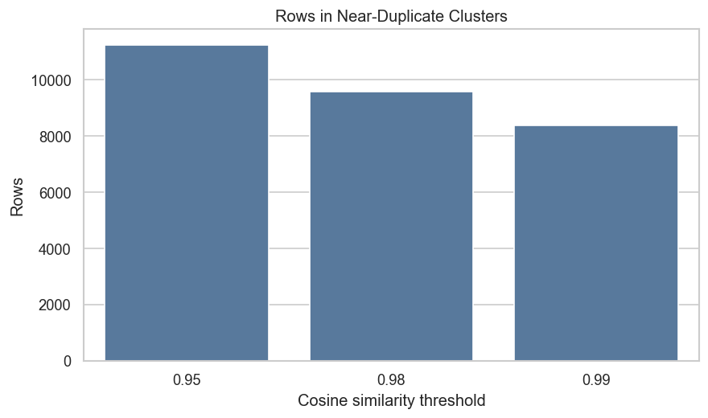
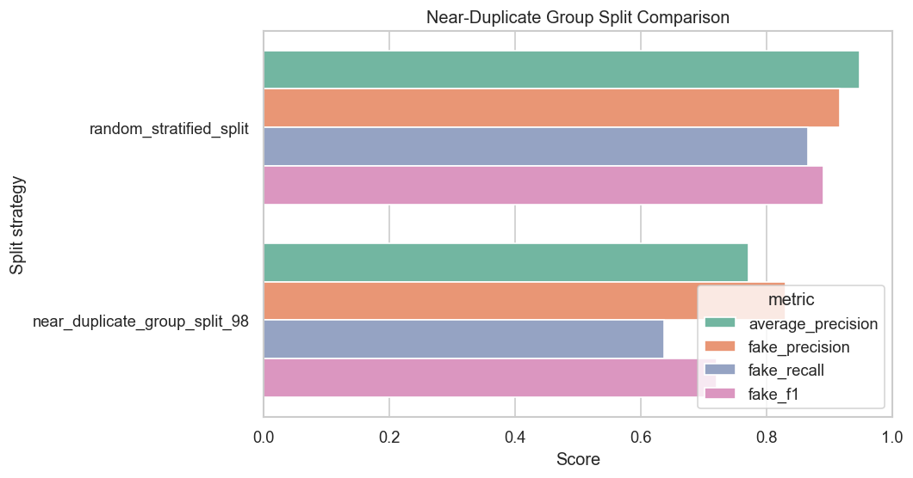
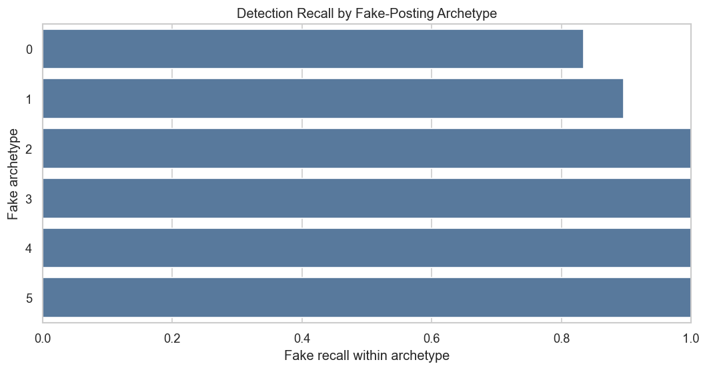

# Future-Work Extension Report

## Purpose

Connecting this project to prior future-work sections is not enough by itself. This report adds two new experiments that move beyond ordinary EMSCAD model comparison:

1. **Near-duplicate / template leakage audit:** tests whether random train-test splits contain highly similar job templates, not just exact duplicates.
2. **Fake-job archetype discovery:** uses unsupervised topic modeling to identify different types of fake postings and evaluate which types are easier or harder for the classifier to detect.

These experiments respond to limitations in the EMSCAD literature without requiring a new external dataset.

Outputs:

- Code: [future_work_extensions.py](future_work_extensions.py)
- Tables: [future_work_outputs/tables](future_work_outputs/tables)
- Figures: [future_work_outputs/figures](future_work_outputs/figures)

## Experiment 1: Near-Duplicate / Template Leakage

The earlier audit looked for exact duplicate content signatures. This extension asks a broader question:

**Do train and test splits share highly similar job-posting templates even when the rows are not exact duplicates?**

Method:

- Combine title, company profile, description, requirements, and benefits text.
- Normalize whitespace and casing.
- Convert postings into TF-IDF features.
- Compress text vectors with Truncated SVD.
- Use nearest-neighbor similarity to form high-similarity clusters.
- Evaluate leakage at cosine similarity thresholds of 0.95, 0.98, and 0.99.
- Compare a random stratified split with a near-duplicate group split.

This is not a perfect semantic duplicate detector, but it is stronger than exact duplicate matching because it captures repeated templates and highly similar postings.

## Near-Duplicate Cluster Results

Table: [near_duplicate_cluster_summary.csv](future_work_outputs/tables/near_duplicate_cluster_summary.csv)

| Similarity Threshold | Near-Duplicate Clusters | Rows in Clusters | Largest Cluster | Mixed-Label Clusters | Fake Rate in Clustered Rows |
|---:|---:|---:|---:|---:|---:|
| 0.95 | 1,500 | 11,251 | 542 | 9 | 0.0445 |
| 0.98 | 1,427 | 9,581 | 428 | 7 | 0.0462 |
| 0.99 | 1,451 | 8,372 | 428 | 3 | 0.0474 |

Figure:

Interpretation: even at a high similarity threshold of 0.98, 9,581 rows fall into near-duplicate/template clusters. This suggests that EMSCAD contains many repeated or highly similar posting templates. The largest high-similarity cluster contains 428 rows.

The mixed-label cluster count is small, which means most high-similarity clusters are label-consistent. That is important because label-consistent repeated templates can make random splits look stronger than they would on truly unseen posting patterns.

## Random Split Near-Duplicate Leakage

Table: [near_duplicate_random_split_leakage.csv](future_work_outputs/tables/near_duplicate_random_split_leakage.csv)

| Similarity Threshold | Overlapping Train/Test Clusters | Test Rows With Train Near-Duplicate Cluster | Share of Test Rows |
|---:|---:|---:|---:|
| 0.95 | 825 | 2,679 | 0.5993 |
| 0.98 | 742 | 2,267 | 0.5072 |
| 0.99 | 743 | 1,946 | 0.4353 |

Interpretation: at the 0.98 threshold, 50.72% of random-split test rows are in a near-duplicate/template cluster that also appears in training. This is much larger than the exact duplicate leakage result.

This does not prove intentional leakage, but it does show that random splitting does not cleanly measure performance on unseen posting templates.

## Near-Duplicate Group Split

Table: [near_duplicate_split_comparison.csv](future_work_outputs/tables/near_duplicate_split_comparison.csv)

Figure:

| Split Strategy | Test Fake Rate | Average Precision | Fake Precision | Fake Recall | Fake F1 | FP | FN |
|---|---:|---:|---:|---:|---:|---:|---:|
| Random stratified split | 0.0483 | 0.9475 | 0.9167 | 0.8657 | 0.8905 | 17 | 29 |
| Near-duplicate group split, 0.98 | 0.0497 | 0.7718 | 0.8304 | 0.6368 | 0.7208 | 29 | 81 |

Interpretation: when high-similarity templates are grouped so that similar postings do not appear in both train and test, fake F1 drops from 0.8905 to 0.7208. Fake recall drops from 0.8657 to 0.6368.

This is a much stronger robustness result than the exact duplicate split. It suggests that benchmark performance may rely partly on repeated templates and highly similar posting language.

## Experiment 2: Fake-Job Archetype Discovery

Prior work has noted that binary fake-vs-real classification is limited. Some fraudulent postings may represent different scam patterns. This experiment uses unsupervised topic modeling to identify fake-posting archetypes within the 866 fraudulent postings.

Method:

- Use only fake postings.
- Build TF-IDF text features from job content.
- Fit a 6-topic NMF model.
- Assign each fake posting to its strongest topic.
- Evaluate model recall within each fake archetype on the holdout set.

The resulting archetypes are not manually verified fraud categories, but they provide a useful exploratory structure for error analysis.

## Fake-Posting Archetypes

Table: [fake_archetype_top_terms.csv](future_work_outputs/tables/fake_archetype_top_terms.csv)

| Archetype | Fake Count | Informal Label | Top Terms |
|---:|---:|---|---|
| 0 | 649 | General professional / business postings | experience, engineering, team, company, industry, services, solutions, work, management, skills |
| 1 | 77 | Work-from-home / typing / data-entry postings | start, entry, internet, home, typing, data entry, positions available, earn |
| 2 | 21 | Online application / contract-document postings | onlyclick apply, online applications, contract, documents, mail |
| 3 | 60 | Cruise / luxury service postings | cruise, free, board, ultra luxury, tax free, good english |
| 4 | 33 | Home-office / independent work postings | internet access, quiet work area, office supplies, little guidance, home |
| 5 | 26 | Small-business financing / sales postings | financing, small medium, credit, business owners, sales, advancement |

Interpretation: the fake class is not homogeneous. Most fake postings fall into a broad professional/business archetype, but several smaller clusters correspond to recognizable scam-like patterns such as work-from-home typing, cruise/service jobs, and financing/sales offers.

## Detection by Fake Archetype

Table: [fake_archetype_detection_summary.csv](future_work_outputs/tables/fake_archetype_detection_summary.csv)

Figure:

| Archetype | Holdout Fake Count | Detected Count | Fake Recall Within Archetype | Mean Score for Fake |
|---:|---:|---:|---:|---:|
| 0 | 157 | 131 | 0.8344 | 0.6739 |
| 1 | 29 | 26 | 0.8966 | 0.7562 |
| 2 | 6 | 6 | 1.0000 | 0.9894 |
| 3 | 10 | 10 | 1.0000 | 0.9915 |
| 4 | 8 | 8 | 1.0000 | 1.0060 |
| 5 | 6 | 6 | 1.0000 | 0.9541 |

Interpretation: the broad general-professional fake archetype is the hardest to detect. It has the largest number of fake postings and the lowest recall, 0.8344. Smaller archetypes such as cruise/service, home-office, and financing postings are detected more reliably in this holdout split.

This suggests a useful explanation for false negatives: the model is better at detecting specific recognizable scam templates than broad fake postings that resemble ordinary professional listings.

## Why These Results Are More Interesting

The near-duplicate and archetype analyses add two new ideas:

1. **Benchmark leakage may be template-based, not just exact-duplicate based.** Exact duplicate leakage was meaningful but modest. Near-duplicate/template leakage is much larger and has a stronger effect on performance.
2. **The fake class contains multiple archetypes with different detection difficulty.** A single fake-vs-real metric hides which fake patterns are easy or hard to detect.

Together, these results produce a stronger claim:

**EMSCAD performance is partly shaped by repeated posting templates and uneven fake-posting archetypes. Benchmark reporting should include near-duplicate-aware splitting and fraud-archetype recall, not only random-split aggregate F1.**

## Limitations

- The near-duplicate method uses TF-IDF/SVD similarity, not manual semantic duplicate review.
- Similarity thresholds are experimental and should be treated as sensitivity settings.
- NMF archetypes are exploratory topics, not verified fraud-type labels.
- The archetype analysis uses one holdout split and should be repeated under cross-validation in future work.
- External validation on newer job-posting data would still be needed for deployment claims.

## Stronger Next Step

The most publishable extension would be to formalize this as an EMSCAD benchmark protocol:

1. Report random split performance.
2. Report exact duplicate group split performance.
3. Report near-duplicate/template group split performance.
4. Report job-id-order split performance.
5. Report shortcut-only feature baselines.
6. Report counterfactual credibility sensitivity.
7. Report fake-archetype recall.

This would turn the project from a classifier comparison into a benchmark reliability study.
