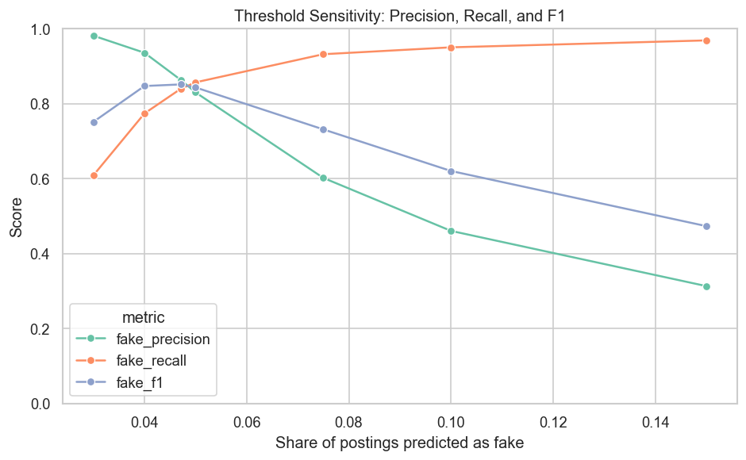

# Imbalance Research Summary

## Research Focus

This repository separates the imbalance-focused research question from the original class project deliverable.

**Main question:** How does class imbalance affect model evaluation, model selection, threshold choice, and error patterns in fake job posting detection?

The analysis uses the existing fake job postings model outputs, then adds a focused research notebook:

- `imbalance_focused_research.ipynb`
- `imbalance_research_outputs/tables/`
- `imbalance_research_outputs/figures/`

## Why Class Imbalance Matters

The cleaned dataset contains:

| Class | Count | Percent |
|---|---:|---:|
| Real postings | 17,014 | 95.16% |
| Fake postings | 866 | 4.84% |

A majority-class baseline can achieve about 95.16% accuracy by predicting every posting as real, but it detects no fake postings. This makes accuracy insufficient as the primary metric.

## Metric-Based Model Selection

The imbalance-focused notebook compared which model appears best under each metric on the cleaned dataset.

| Metric | Winning Model | Score | What the Metric Prioritizes |
|---|---|---:|---|
| Accuracy | Linear SVM balanced | 0.9858 | Overall correctness; strongly affected by majority class |
| Balanced Accuracy | Logistic Regression balanced | 0.9325 | Average performance across both classes |
| ROC AUC | Linear SVM balanced | 0.9890 | Ranking separation across classes |
| Average Precision | Linear SVM balanced | 0.9140 | Ranking quality for the rare fake class |
| Fake Precision | Linear SVM balanced | 0.8636 | Share of predicted fake postings that were actually fake |
| Fake Recall | Complement Naive Bayes text only | 0.9215 | Share of actual fake postings detected |
| Fake F1 | Linear SVM balanced | 0.8512 | Balance of fake precision and fake recall |

Full output: [metric_based_model_winners.csv](imbalance_research_outputs/tables/metric_based_model_winners.csv)

## Interpretation

The selected model changes depending on the metric. Most metrics favor the balanced Linear SVM, but balanced accuracy favors balanced Logistic Regression, and fake recall favors Complement Naive Bayes.

This supports the main research claim: in an imbalanced classification problem, the definition of the best model depends on the evaluation metric.

## Precision-Recall Tradeoff

The cleaned-dataset model comparison shows that models behave differently on fake-class precision and fake-class recall.

Full output: [precision_recall_metric_comparison.csv](imbalance_research_outputs/tables/precision_recall_metric_comparison.csv)

Interpretation: models with higher fake recall tend to flag more postings as fake, which can reduce fake precision. Models with higher fake precision tend to be more selective, which can reduce fake recall.

## Class Weighting

The weighted vs unweighted linear model comparison shows how class weighting changes model behavior.

Full output: [weighted_unweighted_cleaned_comparison.csv](imbalance_research_outputs/tables/weighted_unweighted_cleaned_comparison.csv)

Interpretation: the unweighted Linear SVM had higher fake precision and lower fake recall. The balanced Linear SVM had higher fake recall and lower fake precision.

## Threshold Sensitivity

Changing the decision threshold for the selected balanced Linear SVM changed the number of postings predicted as fake.

Full output: [threshold_sensitivity_summary.csv](imbalance_research_outputs/tables/threshold_sensitivity_summary.csv)

Interpretation: lower thresholds increased fake recall and false positives. Higher thresholds increased fake precision and false negatives.

## Cost Sensitivity

A simple cost sensitivity analysis was added to show how threshold choice changes when false negatives are assigned a higher cost than false positives.

| False Positive Cost | False Negative Cost | Selected Threshold | Flagged Rate | False Positives | False Negatives | Fake Precision | Fake Recall |
|---:|---:|---:|---:|---:|---:|---:|---:|
| 1 | 1 | 0.2374 | 0.0400 | 46 | 196 | 0.9358 | 0.7737 |
| 1 | 2 | 0.0000 | 0.0471 | 115 | 139 | 0.8634 | 0.8395 |
| 1 | 5 | -0.0870 | 0.0500 | 152 | 124 | 0.8300 | 0.8568 |
| 1 | 10 | -0.5056 | 0.0750 | 534 | 59 | 0.6018 | 0.9319 |
| 1 | 20 | -0.5056 | 0.0750 | 534 | 59 | 0.6018 | 0.9319 |

Full output: [cost_sensitivity_threshold_selection.csv](imbalance_research_outputs/tables/cost_sensitivity_threshold_selection.csv)

Interpretation: as the assigned cost of false negatives increases, the selected threshold shifts toward flagging more postings as fake.

## Error Patterns

The notebook also reuses existing error-analysis outputs to connect class imbalance with model errors.

Key outputs:

- [compact_error_group_summary.csv](imbalance_research_outputs/tables/compact_error_group_summary.csv)
- [compact_binary_feature_error_rates.csv](imbalance_research_outputs/tables/compact_binary_feature_error_rates.csv)

Interpretation: real postings without company logo or company profile information had higher false positive rates. This indicates that missing credibility-related metadata was associated with real postings being incorrectly predicted as fake.

## Main Research Claim

The results show that class imbalance affects model evaluation in three connected ways:

1. Accuracy can hide minority-class failure.
2. Different metrics can select different best-performing models.
3. Threshold choice changes the balance between false positives and false negatives.

The imbalance problem is therefore not only a dataset distribution issue. It affects model selection, performance interpretation, and decision threshold behavior.
