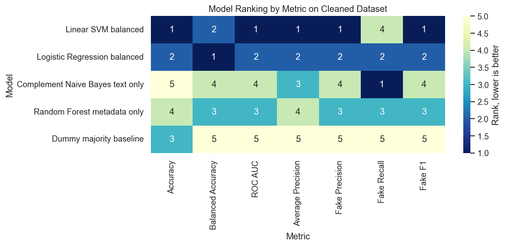
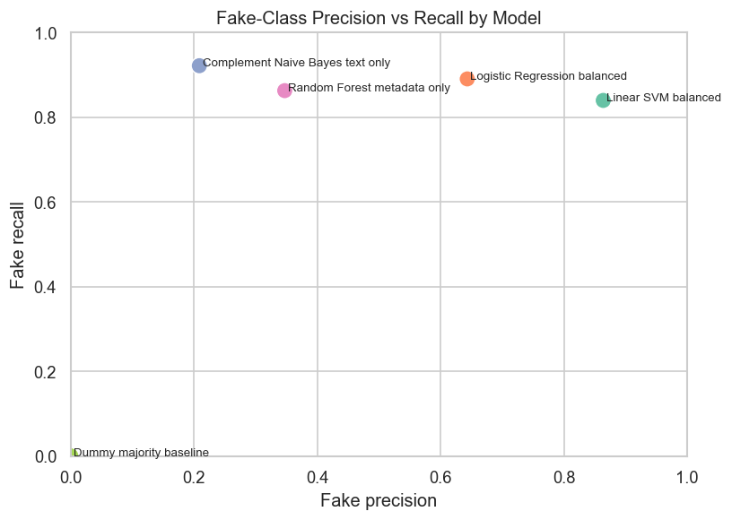
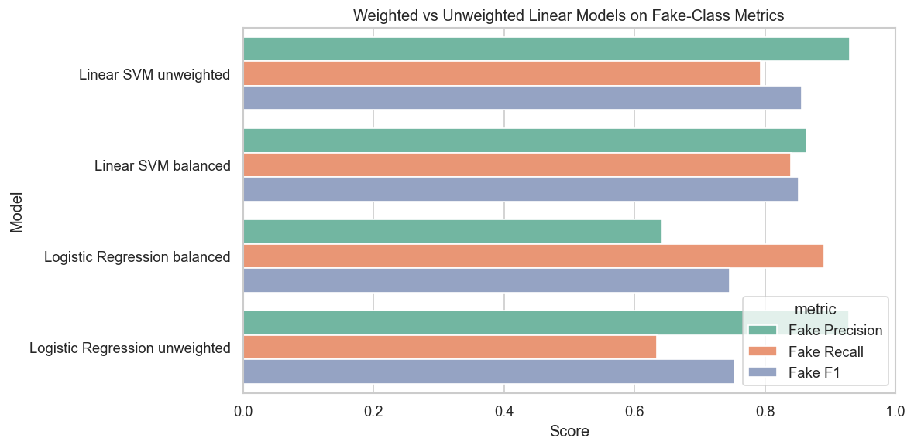
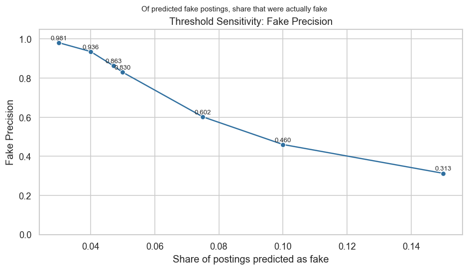
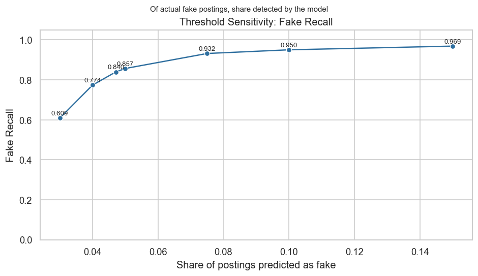
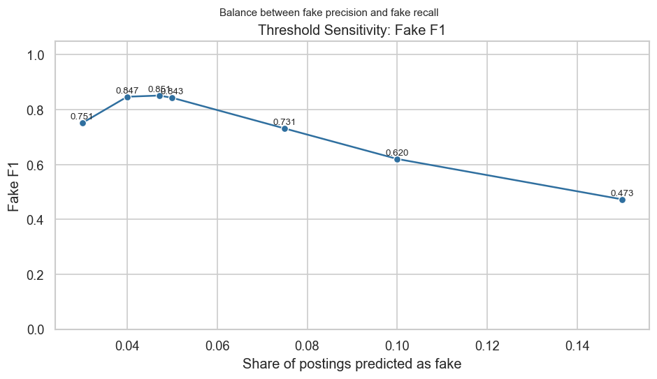
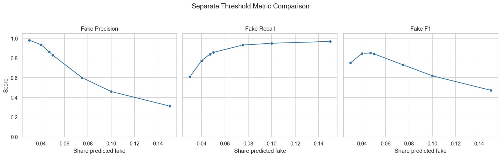
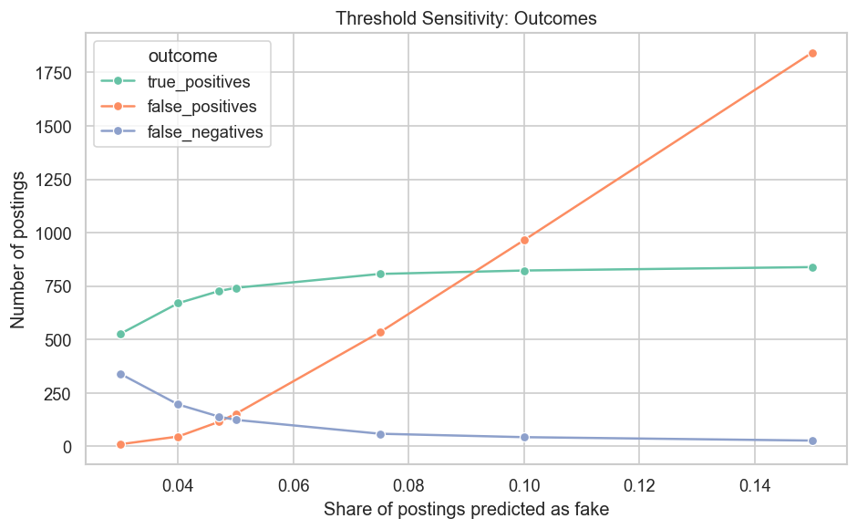
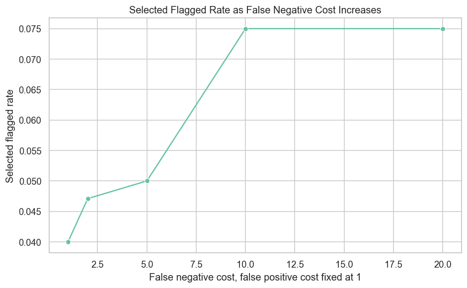
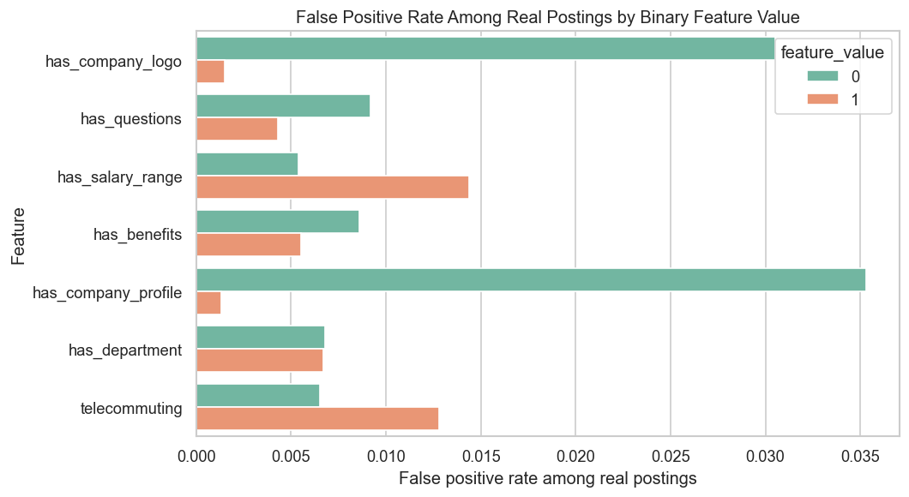

# Imbalance Research Summary

## Research Focus

This repository separates the imbalance-focused research question from the original class project deliverable.

**Main question:** How does class imbalance affect model evaluation, model selection, threshold choice, and error patterns in fake job posting detection?

The analysis uses the existing fake job postings model outputs, then adds a focused research notebook:

- `related_work_and_research_gap.md`
- `benchmark_audit_paper_outline.md`
- `imbalance_focused_research.ipynb`
- `comprehensive_imbalance_experiments.py`
- `comprehensive_imbalance_experiment_report.md`
- `artifact_robustness_audit.py`
- `artifact_robustness_audit_report.md`
- `future_work_extensions.py`
- `future_work_extension_report.md`
- `imbalance_research_outputs/tables/`
- `imbalance_research_outputs/figures/`
- `artifact_audit_outputs/tables/`
- `artifact_audit_outputs/figures/`
- `future_work_outputs/tables/`
- `future_work_outputs/figures/`

## Literature-Grounded Framing

Prior EMSCAD and online recruitment fraud studies repeatedly point toward future work involving richer context, imbalance handling, contemporary validation, company/network signals, and stronger evaluation protocols.

This project uses those future-work directions to reframe the study:

**Working title:** Beyond Accuracy on EMSCAD: A Robustness and Shortcut Audit of Fake Job Posting Detection

**Research gap:** EMSCAD has already been used for many binary fake-vs-real classifiers, but fewer projects ask whether reported performance is stable under duplicate leakage, split strategy, shortcut features, class imbalance decisions, and credibility metadata perturbations.

Related-work gap document: [related_work_and_research_gap.md](related_work_and_research_gap.md)

Paper-style outline: [benchmark_audit_paper_outline.md](benchmark_audit_paper_outline.md)

## New Future-Work Extension Results

The newest experiments go beyond tying the project to prior literature. They add two analyses that directly address remaining benchmark weaknesses:

1. **Near-duplicate / template leakage:** random splits are tested for highly similar posting templates, not only exact duplicate rows.
2. **Fake-posting archetypes:** fraudulent postings are grouped into exploratory NMF topics, then detection recall is measured by archetype.

Key findings:

- At a 0.98 text-similarity threshold, 9,581 rows fall into near-duplicate/template clusters.
- In the random split, 50.72% of test rows share a high-similarity template cluster with training.
- A near-duplicate group split drops fake F1 from 0.8905 to 0.7208.
- A near-duplicate group split drops fake recall from 0.8657 to 0.6368.
- Fake postings cluster into recognizable archetypes, including broad professional postings, work-from-home/data-entry postings, cruise/service postings, home-office postings, and financing/sales postings.
- The broad professional fake archetype is hardest to detect, with recall of 0.8344, while several smaller template-like archetypes reach 1.0000 recall in the holdout split.

Detailed extension report: [future_work_extension_report.md](future_work_extension_report.md)

## Expanded Research Contribution

The project now goes beyond selecting the best classifier. It evaluates whether fake job detection conclusions stay stable when the underlying decision context changes.

The expanded experiments test:

1. **Prevalence sensitivity:** how fake precision, recall, and F1 change when the fake-job base rate changes.
2. **Review budget sensitivity:** how many fake postings are caught when only the top-scored postings can be reviewed.
3. **Cost sensitivity:** how the selected threshold changes when false negatives are treated as more costly.
4. **Training distribution sensitivity:** how class weighting, undersampling, and oversampling change model behavior.
5. **Feature group sensitivity:** whether performance comes mainly from text, metadata, binary credibility indicators, or length features.
6. **Label scarcity sensitivity:** how rare-class performance changes when fewer fake postings are available for training.

Detailed report: [comprehensive_imbalance_experiment_report.md](comprehensive_imbalance_experiment_report.md)

## Artifact, Leakage, and Robustness Audit

The newest audit asks whether strong model performance is trustworthy or partly explained by dataset artifacts.

The audit tests:

1. **Duplicate leakage:** whether exact content signatures appear in both train and test.
2. **Split robustness:** whether performance changes under random, duplicate-group, and job-id-order splits.
3. **Shortcut features:** whether missingness, credibility flags, and length features can predict fake postings without text.
4. **Counterfactual credibility edits:** whether removing or adding company profile/logo/benefits changes model predictions.
5. **Subgroup robustness:** whether errors differ by posting type and credibility metadata.
6. **Error case studies:** which real postings are falsely flagged and which fake postings are missed.

Key audit findings:

- The random split has duplicate-content leakage: 13.8% of test rows share an exact content signature with training.
- Duplicate-group splitting causes a modest drop in fake F1, from 0.8905 to 0.8786.
- Job-id-order splitting causes a larger drop in fake recall, from 0.8657 to 0.6789.
- Shortcut-only models perform poorly, so the classifier is not explained by flags and lengths alone.
- Counterfactual credibility edits have a large effect: removing company profile/logo/benefits increases false positives from 17 to 143.
- Adding generic credibility information to sparse rows reduces false positives from 17 to 4 but increases missed fake postings from 29 to 54.

Detailed audit report: [artifact_robustness_audit_report.md](artifact_robustness_audit_report.md)

## Why Class Imbalance Matters

The cleaned dataset contains:

| Class | Count | Percent |
|---|---:|---:|
| Real postings | 17,014 | 95.16% |
| Fake postings | 866 | 4.84% |

A majority-class baseline can achieve about 95.16% accuracy by predicting every posting as real, but it detects no fake postings. This makes accuracy insufficient as the primary metric.

## Metric-Based Model Selection

The imbalance-focused notebook compared which model appears best under each metric on the cleaned dataset.

| Metric | Winning Model | Score | What the Metric Prioritizes |
|---|---|---:|---|
| Accuracy | Linear SVM balanced | 0.9858 | Overall correctness; strongly affected by majority class |
| Balanced Accuracy | Logistic Regression balanced | 0.9325 | Average performance across both classes |
| ROC AUC | Linear SVM balanced | 0.9890 | Ranking separation across classes |
| Average Precision | Linear SVM balanced | 0.9140 | Ranking quality for the rare fake class |
| Fake Precision | Linear SVM balanced | 0.8636 | Share of predicted fake postings that were actually fake |
| Fake Recall | Complement Naive Bayes text only | 0.9215 | Share of actual fake postings detected |
| Fake F1 | Linear SVM balanced | 0.8512 | Balance of fake precision and fake recall |

Full output: [metric_based_model_winners.csv](imbalance_research_outputs/tables/metric_based_model_winners.csv)



## Interpretation

The selected model changes depending on the metric. Most metrics favor the balanced Linear SVM, but balanced accuracy favors balanced Logistic Regression, and fake recall favors Complement Naive Bayes.

This supports the main research claim: in an imbalanced classification problem, the definition of the best model depends on the evaluation metric.

## Precision-Recall Tradeoff

The cleaned-dataset model comparison shows that models behave differently on fake-class precision and fake-class recall.



Full output: [precision_recall_metric_comparison.csv](imbalance_research_outputs/tables/precision_recall_metric_comparison.csv)

Interpretation: models with higher fake recall tend to flag more postings as fake, which can reduce fake precision. Models with higher fake precision tend to be more selective, which can reduce fake recall.

## Class Weighting

The weighted vs unweighted linear model comparison shows how class weighting changes model behavior.



Full output: [weighted_unweighted_cleaned_comparison.csv](imbalance_research_outputs/tables/weighted_unweighted_cleaned_comparison.csv)

Interpretation: the unweighted Linear SVM had higher fake precision and lower fake recall. The balanced Linear SVM had higher fake recall and lower fake precision.

## Threshold Sensitivity

Changing the decision threshold for the selected balanced Linear SVM changed the number of postings predicted as fake. The x-axis in both threshold plots is the share of all postings predicted as fake. The y-axis is either a metric score or an outcome count, depending on the plot.

The separate plots below show each metric individually before comparing them together.



Fake precision decreases as the flagged rate increases because the model includes more borderline real postings in the predicted-fake group.



Fake recall increases as the flagged rate increases because more actual fake postings are captured.



Fake F1 is highest near the default threshold because that region balances precision and recall more evenly.



The panel view shows the three metrics on the same x-axis while keeping each metric in its own subplot. This avoids compressing three different metric patterns into one visual.



In the outcomes plot, false positives rise sharply when the share predicted as fake increases. This happens because the real class is much larger than the fake class. The dataset has 17,014 real postings and 866 fake postings, so even a small fraction of real postings being incorrectly flagged can create a large false-positive count.

Full output: [threshold_sensitivity_summary.csv](imbalance_research_outputs/tables/threshold_sensitivity_summary.csv)

Detailed explanation: [threshold_interpretation.md](threshold_interpretation.md)

## Cost Sensitivity

The cost sensitivity analysis evaluates how the selected decision threshold changes when different types of classification errors are assigned different costs. This is useful because the fake job class is rare, and the practical meaning of an error depends on whether the model incorrectly flags a real posting or misses a fake posting.

The analysis uses two error types:

| Error Type | Meaning |
|---|---|
| False positive | A real job posting incorrectly predicted as fake |
| False negative | A fake job posting incorrectly predicted as real |

The false positive cost is held constant at `1`. The false negative cost is tested at `1`, `2`, `5`, `10`, and `20`. For each threshold, total cost is calculated as:

```text
total cost = (false positives * false positive cost) + (false negatives * false negative cost)
```

The selected threshold is the threshold with the lowest total cost under each cost assumption.

| False Positive Cost | False Negative Cost | Selected Threshold | Flagged Rate | False Positives | False Negatives | Fake Precision | Fake Recall | Total Cost |
|---:|---:|---:|---:|---:|---:|---:|---:|---:|
| 1 | 1 | 0.2374 | 0.0400 | 46 | 196 | 0.9358 | 0.7737 | 242 |
| 1 | 2 | 0.0000 | 0.0471 | 115 | 139 | 0.8634 | 0.8395 | 393 |
| 1 | 5 | -0.0870 | 0.0500 | 152 | 124 | 0.8300 | 0.8568 | 772 |
| 1 | 10 | -0.5056 | 0.0750 | 534 | 59 | 0.6018 | 0.9319 | 1,124 |
| 1 | 20 | -0.5056 | 0.0750 | 534 | 59 | 0.6018 | 0.9319 | 1,714 |

Full output: [cost_sensitivity_threshold_selection.csv](imbalance_research_outputs/tables/cost_sensitivity_threshold_selection.csv)



Interpretation: when false positives and false negatives are treated equally, the selected threshold is `0.2374`. This threshold is conservative: it predicts only 4% of postings as fake, produces 46 false positives, and misses 196 fake postings. Fake precision is high at 0.9358, but fake recall is lower at 0.7737.

When false negatives are assigned higher cost, the selected threshold moves downward. A lower threshold causes the model to predict fake more often. This reduces false negatives and increases fake recall, but it also increases false positives and lowers fake precision.

At a false negative cost of `10`, the selected threshold is `-0.5056`. The model predicts 7.5% of postings as fake, reducing false negatives from 196 to 59. However, false positives increase from 46 to 534, and fake precision falls from 0.9358 to 0.6018. This shows the practical tradeoff: catching more fake postings requires accepting more incorrectly flagged real postings.

The plot shows this same pattern visually. The x-axis is the assumed false negative cost while the false positive cost remains fixed at `1`. The y-axis is the selected flagged rate, meaning the share of all postings predicted as fake at the cost-minimizing threshold. As the false negative cost increases, the selected flagged rate increases from 0.0400 to 0.0750.

The curve levels off at false negative costs of `10` and `20` because the tested thresholds are discrete. Among the available thresholds, `-0.5056` has the lowest total cost for both cost settings.

This analysis is a sensitivity test, not a final operational cost model. The cost values are hypothetical, and the analysis does not estimate actual financial, ethical, or review costs. Its value is that it shows how model interpretation changes when missed fake postings are treated as more serious than incorrectly flagged real postings.

Detailed explanation: [cost_sensitivity_interpretation.md](cost_sensitivity_interpretation.md)

## Error Patterns

The notebook also reuses existing error-analysis outputs to connect class imbalance with model errors.

Key outputs:

- [compact_error_group_summary.csv](imbalance_research_outputs/tables/compact_error_group_summary.csv)
- [compact_binary_feature_error_rates.csv](imbalance_research_outputs/tables/compact_binary_feature_error_rates.csv)



Interpretation: real postings without company logo or company profile information had higher false positive rates. This indicates that missing credibility-related metadata was associated with real postings being incorrectly predicted as fake.

## Main Research Claim

The results show that class imbalance affects model evaluation in several connected ways:

1. Accuracy can hide minority-class failure.
2. Different metrics can select different best-performing models.
3. Threshold choice changes the balance between false positives and false negatives.
4. Fake precision changes when the fake-job prevalence changes.
5. Review capacity changes the practical value of the model.
6. Training balance strategies can improve or harm rare-class performance.
7. Feature groups and label scarcity affect which errors the model makes.
8. Duplicate leakage, split strategy, and credibility metadata affect whether performance should be trusted as real-world fraud detection.
9. Near-duplicate/template leakage is larger than exact duplicate leakage and has a stronger effect on model performance.
10. Aggregate fake-class metrics hide that some fake-posting archetypes are easier to detect than others.

The imbalance problem is therefore not only a dataset distribution issue. It affects model selection, performance interpretation, decision threshold behavior, review-policy design, training strategy, error analysis, and robustness claims.


