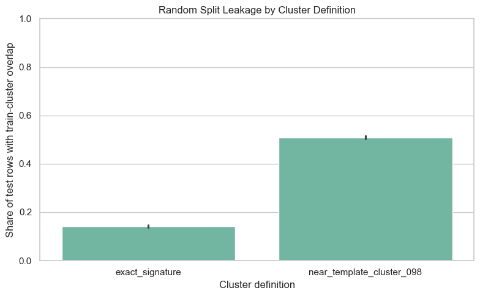
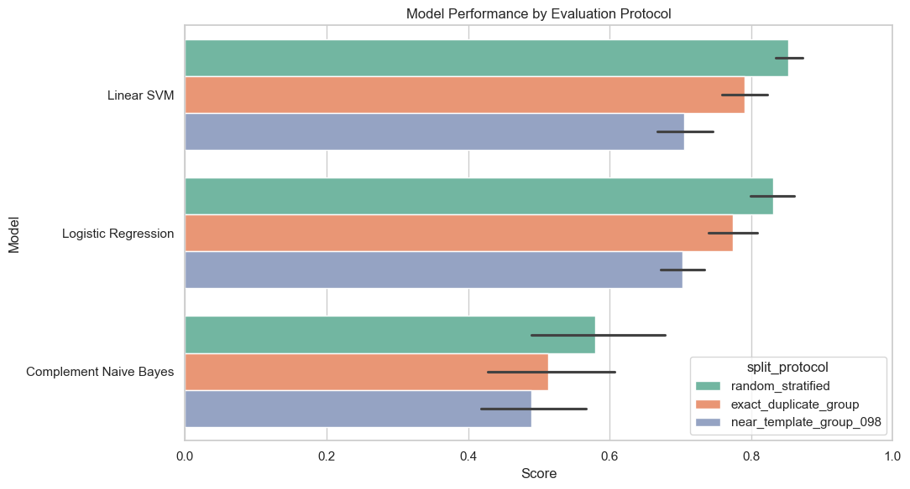
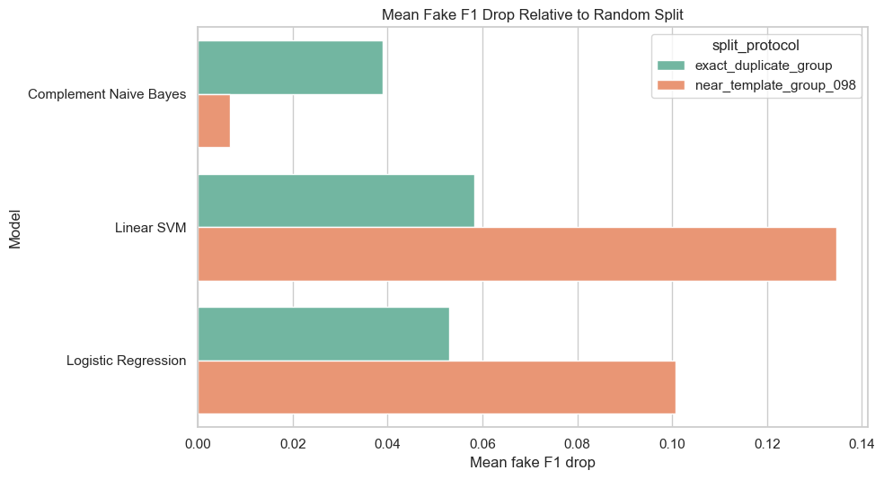

# Template Leakage in EMSCAD: A Leakage-Aware Re-Evaluation of Fake Job Posting Detection

## Abstract

The Employment Scam Aegean Dataset (EMSCAD) is a widely used public benchmark for online recruitment fraud detection. Most work using EMSCAD treats the task as binary classification and reports model performance under random train-test splits. This paper evaluates whether that protocol overstates model performance when repeated or near-repeated job-posting templates appear in both training and test data. We audit exact duplicate content signatures and high-similarity near-template clusters in EMSCAD, then compare three classic text classifiers under three evaluation protocols: random stratified splitting, exact-duplicate group splitting, and near-template group splitting. Across five random seeds, exact duplicate content appears in 2,755 rows, while near-template clusters at a 0.98 cosine-similarity threshold contain 9,581 rows. Under random splitting, 14.13% of test rows share an exact signature with the training set, and 50.94% share a near-template cluster with the training set. Leakage-aware splitting reduces performance most strongly for the stronger text models: Linear SVM fake-class F1 declines from 0.8391 under random splitting to 0.7045 under near-template splitting, and Logistic Regression fake-class F1 declines from 0.7505 to 0.6499. Average precision drops by 0.1410 for Linear SVM and 0.1493 for Logistic Regression under the near-template protocol. These results suggest that random-split EMSCAD results can be optimistic because they partially evaluate recognition of repeated templates rather than generalization to genuinely unseen posting forms. We recommend that future EMSCAD studies report leakage-aware split results alongside random-split metrics.

## 1. Introduction

Online recruitment fraud harms job seekers through identity theft, financial scams, and deceptive employment offers. The EMSCAD dataset introduced by Vidros et al. has become a common benchmark for studying automatic online recruitment fraud detection. EMSCAD contains 17,880 job advertisements, including 17,014 legitimate postings and 866 fraudulent postings, producing a highly imbalanced binary classification problem.

Many student projects and published studies approach EMSCAD by comparing classifiers on a random split. That is a reasonable starting point, but it may hide a benchmark reliability issue. Job postings often reuse templates. Real companies may repost nearly identical descriptions across locations, and fraudulent campaigns may reuse repeated text patterns. If a random split places one version of a repeated template in training and another version in testing, the resulting test score may reflect template memorization or near-template recognition rather than robust fraud detection.

This paper reframes EMSCAD from a model-selection problem to a benchmark-audit problem. Instead of asking only which classifier scores highest, we ask whether the evaluation protocol itself allows content leakage through exact duplicates and near-duplicate posting templates.

## 2. Research Questions

**RQ1:** How much exact duplicate and near-template content exists in EMSCAD?

**RQ2:** How often does random stratified splitting place related templates in both training and test sets?

**RQ3:** Does model performance decline when exact duplicate groups or near-template groups are kept entirely on one side of the train-test split?

**RQ4:** Is near-template leakage more consequential than exact duplicate leakage for classic text classifiers?

## 3. Related Work

Vidros et al. introduced EMSCAD and analyzed online recruitment fraud using job text and metadata features. The dataset remains important because it is public, manually labeled, and large enough for standard machine learning experiments.

Subsequent fake-job detection work has often focused on improving model performance or handling class imbalance. Vo et al. studied class imbalance in fake job description detection using oversampling. Alghamdi and Alharby used EMSCAD for an online recruitment fraud detection model and reported strong classifier performance. Mahbub, Pardede, and Kayes emphasized the importance of contextual features and localization in online recruitment fraud detection.

This paper does not propose a new classifier. Its contribution is a benchmark evaluation audit. The closest methodological issue is data leakage through duplicate or highly similar records across random splits. In benchmark settings with repeated templates, random splitting can make test data less independent than it appears. For EMSCAD, this matters because fake-job detection results may be interpreted as deployment readiness even though the model has been evaluated on postings structurally similar to training examples.

## 4. Dataset

The study uses the cleaned EMSCAD file included in this repository: `Data/fake_jobs_cleaned.csv`. The target variable is `fraudulent`, where `1` indicates a fake posting and `0` indicates a real posting.

The cleaned dataset preserves the main EMSCAD text fields:

- `title`
- `company_profile`
- `description`
- `requirements`
- `benefits`

It also includes structured and binary fields such as:

- `employment_type`
- `required_experience`
- `required_education`
- `industry`
- `function`
- `telecommuting`
- `has_company_logo`
- `has_questions`

The publication experiment intentionally uses only text fields for model training. This design isolates template leakage in posting content. Metadata, missingness flags, and credibility indicators are excluded from the publication matrix so that performance changes can be interpreted as text-template robustness rather than mixed text-metadata behavior.

## 5. Methods

### 5.1 Text Representation

For each row, the main text fields are concatenated into one document. Text is represented with TF-IDF features using unigram and bigram terms, English stop-word removal, sublinear term frequency scaling, and a maximum vocabulary size of 60,000 features.

### 5.2 Models

Three classic text classifiers are evaluated:

- **Linear SVM:** a strong sparse-text baseline with class weighting.
- **Logistic Regression:** a probabilistic linear baseline with class weighting.
- **Complement Naive Bayes:** a common baseline for imbalanced text classification.

The goal is not to find the newest or most complex model. The goal is to test whether standard text classifiers lose performance when evaluation prevents repeated-template leakage.

### 5.3 Split Protocols

Three train-test protocols are compared.

**Random stratified split:** rows are split randomly while preserving the fake-class rate.

**Exact duplicate group split:** rows with the same normalized content signature are assigned to the same side of the split. This prevents exact duplicate content from appearing in both training and test sets.

**Near-template group split:** rows are embedded with TF-IDF followed by truncated SVD, normalized, and compared with nearest-neighbor cosine similarity. Rows connected by cosine similarity of at least 0.98 are assigned to the same near-template cluster. The train-test split is then performed at the group level so that near-template clusters do not cross the train-test boundary.

### 5.4 Repeated Evaluation

Each model and split protocol is evaluated across five random seeds:

`7, 13, 23, 31, 43`

This produces 45 model runs:

`3 models x 3 split protocols x 5 seeds`

The reported metrics are mean and standard deviation across seeds.

### 5.5 Metrics

Because EMSCAD is highly imbalanced, accuracy is not used as the primary metric. The paper reports:

- **Average precision:** area under the precision-recall curve, emphasizing fake-class ranking quality.
- **Fake precision:** among postings predicted as fake, the share that are actually fake.
- **Fake recall:** among fake postings, the share detected by the model.
- **Fake F1:** harmonic mean of fake precision and fake recall.
- **False positives:** real postings incorrectly flagged as fake.
- **False negatives:** fake postings missed by the model.

## 6. Results

### 6.1 Exact Duplicate and Near-Template Content

The exact-signature audit identified 747 duplicate-content groups containing 2,755 rows. The largest exact duplicate group contained 375 postings. The near-template audit identified 1,427 clusters containing 9,581 rows at the 0.98 threshold. Only seven near-template clusters contained both real and fake labels, which means the high-similarity clusters are usually label-consistent.

| cluster_type | cluster_count | rows_in_clusters | largest_cluster | mixed_label_clusters | fake_rate_clustered_rows |
| --- | ---: | ---: | ---: | ---: | ---: |
| exact_signature | 747 | 2755 | 375 | 0 | 0.0701 |
| near_template_cluster_098 | 1427 | 9581 | 428 | 7 | 0.0462 |

**Interpretation.** EMSCAD contains substantial repeated structure. Exact duplicates are present, but near-template repetition is much broader. More than half of the dataset belongs to a near-template cluster under the 0.98 similarity rule. This indicates that random splitting can create a test set that contains postings very similar to the training set.

### 6.2 Random Split Leakage

Under random stratified splitting, an average of 14.13% of test rows shared an exact content signature with training rows. For near-template clusters, the average overlap was 50.94% of test rows.

| cluster_type | overlapping_clusters_mean | test_rows_with_train_cluster_mean | share_test_rows_with_train_cluster_mean | share_test_rows_with_train_cluster_std |
| --- | ---: | ---: | ---: | ---: |
| exact_signature | 369.0000 | 631.8000 | 0.1413 | 0.0054 |
| near_template_cluster_098 | 757.6000 | 2277.2000 | 0.5094 | 0.0058 |

**Interpretation.** The random split is not fully independent at the content-template level. Exact duplicate leakage affects a meaningful minority of test examples, while near-template leakage affects about half of the test set. This is the central benchmark concern: a model can score well partly because it has already seen highly similar posting structures during training.

### 6.3 Model Performance by Evaluation Protocol

The model comparison shows that random splitting produces the highest results for the stronger text classifiers. Performance declines under exact duplicate group splitting and declines more under near-template group splitting.

| model | split_protocol | average_precision_mean | average_precision_std | fake_precision_mean | fake_precision_std | fake_recall_mean | fake_recall_std | fake_f1_mean | fake_f1_std | false_positives_mean | false_positives_std | false_negatives_mean | false_negatives_std |
| --- | --- | ---: | ---: | ---: | ---: | ---: | ---: | ---: | ---: | ---: | ---: | ---: | ---: |
| Complement Naive Bayes | exact_duplicate_group | 0.4288 | 0.0543 | 0.2277 | 0.0218 | 0.7602 | 0.0819 | 0.3502 | 0.0330 | 552.2000 | 40.4438 | 51.6000 | 18.4337 |
| Complement Naive Bayes | near_template_group_098 | 0.4229 | 0.0924 | 0.2728 | 0.0857 | 0.6620 | 0.0935 | 0.3825 | 0.1044 | 435.0000 | 207.3777 | 74.6000 | 19.7053 |
| Complement Naive Bayes | random_stratified | 0.5132 | 0.0559 | 0.2538 | 0.0165 | 0.8355 | 0.0202 | 0.3892 | 0.0210 | 533.4000 | 39.2148 | 35.6000 | 4.3932 |
| Linear SVM | exact_duplicate_group | 0.8417 | 0.0453 | 0.8185 | 0.0372 | 0.7498 | 0.0773 | 0.7808 | 0.0464 | 35.8000 | 9.4446 | 53.8000 | 17.3407 |
| Linear SVM | near_template_group_098 | 0.7560 | 0.0585 | 0.7639 | 0.0373 | 0.6568 | 0.0933 | 0.7045 | 0.0641 | 44.6000 | 6.6933 | 75.8000 | 19.7661 |
| Linear SVM | random_stratified | 0.8970 | 0.0183 | 0.8590 | 0.0135 | 0.8208 | 0.0346 | 0.8391 | 0.0195 | 29.2000 | 3.5637 | 38.8000 | 7.5631 |
| Logistic Regression | exact_duplicate_group | 0.8311 | 0.0439 | 0.6233 | 0.0394 | 0.7953 | 0.0544 | 0.6976 | 0.0299 | 103.8000 | 18.7537 | 44.0000 | 12.3491 |
| Logistic Regression | near_template_group_098 | 0.7315 | 0.0563 | 0.5902 | 0.0250 | 0.7268 | 0.0700 | 0.6499 | 0.0293 | 112.2000 | 17.1085 | 60.4000 | 15.2414 |
| Logistic Regression | random_stratified | 0.8808 | 0.0189 | 0.6645 | 0.0092 | 0.8623 | 0.0228 | 0.7505 | 0.0140 | 94.2000 | 2.2804 | 29.8000 | 4.9699 |

**Interpretation.** Linear SVM is the strongest model under random splitting and remains strongest under leakage-aware splitting, but its performance is meaningfully lower when near-template clusters are held out. Logistic Regression shows the same pattern. Complement Naive Bayes performs substantially worse overall and has high false-positive counts, making it less useful as the primary model for this dataset.

### 6.4 Performance Drops Relative to Random Splitting

Near-template grouping produces larger drops than exact duplicate grouping for the stronger text models. For Linear SVM, fake F1 drops by 0.0582 under exact duplicate grouping and by 0.1346 under near-template grouping. For Logistic Regression, fake F1 drops by 0.0529 under exact duplicate grouping and by 0.1006 under near-template grouping.

| model | split_protocol | average_precision_drop_vs_random_mean | average_precision_drop_vs_random_std | fake_recall_drop_vs_random_mean | fake_recall_drop_vs_random_std | fake_f1_drop_vs_random_mean | fake_f1_drop_vs_random_std |
| --- | --- | ---: | ---: | ---: | ---: | ---: | ---: |
| Complement Naive Bayes | exact_duplicate_group | 0.0844 | 0.0638 | 0.0753 | 0.0919 | 0.0390 | 0.0396 |
| Complement Naive Bayes | near_template_group_098 | 0.0903 | 0.1438 | 0.1735 | 0.0910 | 0.0067 | 0.0935 |
| Linear SVM | exact_duplicate_group | 0.0553 | 0.0367 | 0.0709 | 0.0731 | 0.0582 | 0.0450 |
| Linear SVM | near_template_group_098 | 0.1410 | 0.0504 | 0.1640 | 0.0873 | 0.1346 | 0.0536 |
| Logistic Regression | exact_duplicate_group | 0.0497 | 0.0413 | 0.0670 | 0.0549 | 0.0529 | 0.0387 |
| Logistic Regression | near_template_group_098 | 0.1493 | 0.0488 | 0.1355 | 0.0710 | 0.1006 | 0.0293 |

**Interpretation.** The stronger models lose substantially more performance under near-template grouping than under exact duplicate grouping. This supports the claim that exact duplicate removal is not enough. A benchmark can still leak information through high-similarity templates even when exact duplicates are controlled.

## 7. Discussion

The results support a focused conclusion: EMSCAD contains enough repeated and near-repeated posting content that random-split evaluation can overstate generalization performance. The strongest evidence is not merely that duplicates exist, but that performance declines when related templates are prevented from crossing the train-test boundary.

The effect is largest for Linear SVM and Logistic Regression, which are the strongest text models in this experiment. Under random splitting, Linear SVM achieves 0.8970 average precision and 0.8391 fake F1. Under near-template grouping, it drops to 0.7560 average precision and 0.7045 fake F1. Logistic Regression drops from 0.8808 to 0.7315 average precision and from 0.7505 to 0.6499 fake F1. These are not small reporting differences; they change the interpretation of how reliable the classifier is on truly unseen posting templates.

Complement Naive Bayes behaves differently because it is already a weak, high-recall, high-false-positive baseline. Its fake recall declines under near-template grouping, but fake F1 does not drop much because precision remains low and unstable. This does not contradict the leakage claim. Instead, it shows that weak baselines may be less sensitive in F1 because their decision boundary is already noisy.

These findings also clarify the relationship between class imbalance and leakage. The dataset is imbalanced, but imbalance alone is not the full story. A model can handle imbalance with class weights and still benefit from template overlap. Therefore, EMSCAD evaluation should address both problems: minority-class metrics and template-aware splitting.

## 8. Benchmark Reporting Recommendations

Future EMSCAD studies should report:

1. The exact train-test splitting protocol.
2. Fake-class precision, recall, F1, and average precision rather than accuracy alone.
3. Duplicate or near-duplicate leakage checks between train and test data.
4. At least one group-based split that prevents exact duplicate content from crossing the split.
5. A near-template split or semantic similarity split when models use text.
6. Performance drops from random splitting to leakage-aware splitting.
7. Error counts, especially false positives and false negatives, because fake-job detection has asymmetric real-world consequences.

## 9. Threats to Validity

The near-template threshold of 0.98 is heuristic. It is strict enough to identify highly similar postings, but other thresholds should be tested in future work.

The near-template clustering method uses TF-IDF, truncated SVD, and cosine similarity. This captures lexical and low-dimensional semantic similarity, but it is not equivalent to manual duplicate review or modern sentence-embedding clustering.

This study uses EMSCAD only. External validation on newer job postings would be needed before making deployment claims.

The experiment uses five random seeds. This is enough to show a stable pattern in this project, but a full submission could increase the number of seeds.

The publication matrix uses text-only models. This isolates template leakage but does not measure how structured metadata or company credibility features interact with leakage-aware evaluation.

## 10. Conclusion

This study shows that EMSCAD contains substantial exact duplicate and near-template repetition, and that random splitting allows a large share of test postings to share content structure with training postings. When evaluation prevents exact duplicate or near-template clusters from crossing the split, performance declines, especially for the strongest text classifiers. The near-template split produces the largest performance drops, indicating that exact duplicate removal alone is not sufficient.

The main contribution is a leakage-aware benchmark protocol for EMSCAD. The results do not imply that EMSCAD is unusable or that text classifiers lack value. They show that EMSCAD results should be interpreted with care and that future work should report leakage-aware splits alongside conventional random-split results.

## Reproducibility

Main experiment script:

`publication_template_leakage_study.py`

Generated tables:

`publication_outputs/tables/`

Generated figures:

`publication_outputs/figures/`

Primary result files:

- `publication_outputs/tables/cluster_summary.csv`
- `publication_outputs/tables/random_split_leakage_summary.csv`
- `publication_outputs/tables/repeated_split_model_summary.csv`
- `publication_outputs/tables/split_performance_drop_summary.csv`

## References

Vidros, S., Kolias, C., Kambourakis, G., and Akoglu, L. (2017). Automatic Detection of Online Recruitment Frauds: Characteristics, Methods, and a Public Dataset. Future Internet. https://www.mdpi.com/1999-5903/9/1/6

Vo, T., Vo, A., Nguyen, T., Sharma, R., and Le, T. (2021). Dealing with the Class Imbalance Problem in the Detection of Fake Job Descriptions. Computers, Materials and Continua. https://www.techscience.com/cmc/v68n1/41824/html

Mahbub, S., Pardede, E., and Kayes, A. S. M. (2022). Online Recruitment Fraud Detection: A Study on Contextual Features in Australian Job Industries. IEEE Access. https://ieeexplore.ieee.org/document/9852237/

Alghamdi, B., and Alharby, F. (2019). An Intelligent Model for Online Recruitment Fraud Detection. Journal of Information Security. https://www.scirp.org/journal/paperinformation?paperid=93637

