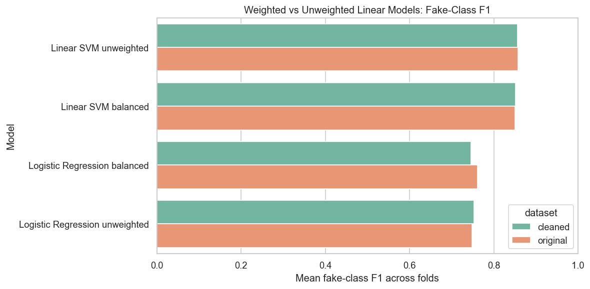
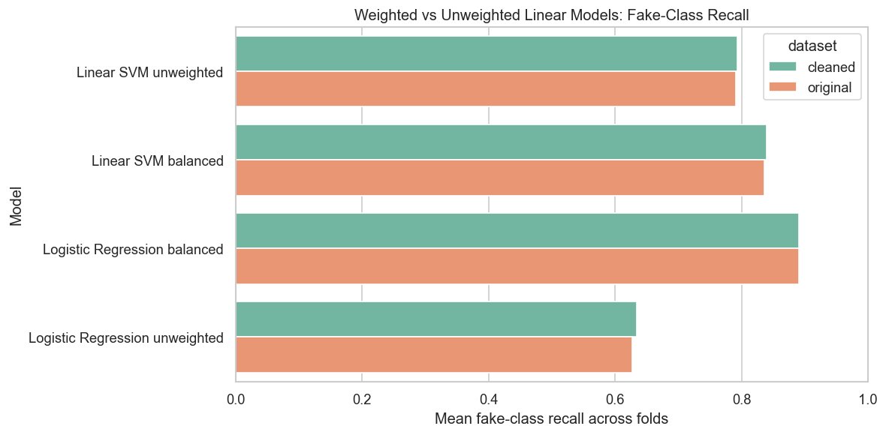
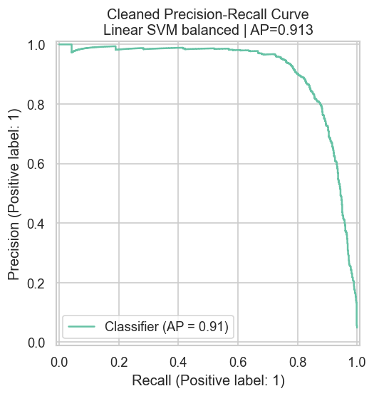
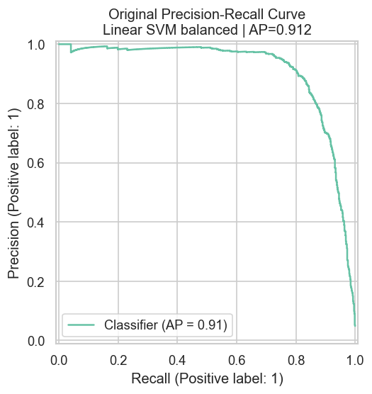
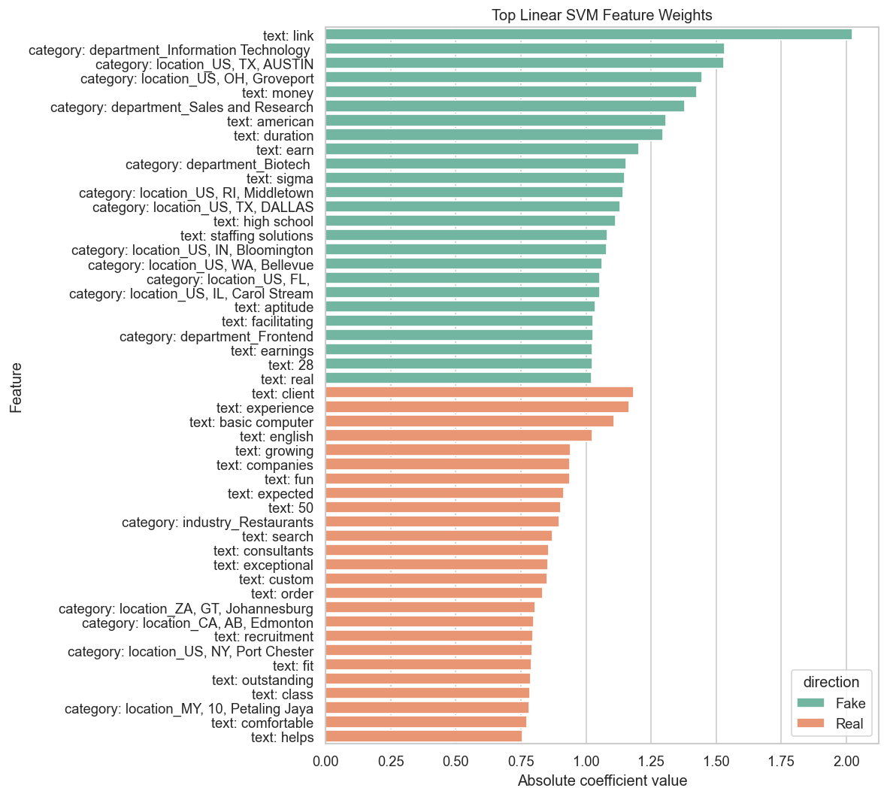

# Results and Analysis

This document summarizes the main findings from the fake job postings project. It is intended to be a readable companion to the full notebook outputs in `job_postings_eda_model_comparison.ipynb`.

## Executive Summary

The dataset is highly imbalanced: only about 4.84% of job postings are labeled fake. Because of that imbalance, accuracy is not a reliable headline metric. A majority-class baseline can reach about 95.16% accuracy while identifying zero fake postings.

The strongest overall classic model was a linear SVM using TF-IDF text features plus metadata. The cleaned and feature-engineered dataset performed only slightly better than the original dataset, suggesting that most of the predictive signal is already present in the raw text fields.

The most useful project framing is therefore:

**Fake job detection is not just a classification problem. It is an imbalanced classification problem where model selection depends on the precision-recall tradeoff for the rare fake class.**

## Research Questions

1. How imbalanced is the dataset, and why does that matter?
2. Is accuracy misleading for fake job detection?
3. Which classic machine learning model performs best on the minority fake class?
4. Does the cleaned and feature-engineered dataset improve model performance compared with the original dataset?
5. Which evaluation metric gives the most useful view of model performance?
6. What tradeoff exists between catching fake jobs and falsely flagging real jobs?
7. Do class-weighted models perform better than unweighted models on minority-class metrics?
8. Which words or metadata features appear most predictive of fraudulent postings?
9. What kinds of postings are most likely to become false positives or false negatives?

## Dataset Summary

| Dataset | Rows | Columns | Real Count | Fake Count | Fake Rate |
|---|---:|---:|---:|---:|---:|
| cleaned | 17,880 | 32 | 17,014 | 866 | 4.84% |
| original | 17,880 | 18 | 17,014 | 866 | 4.84% |

Full table: [dataset_summary.csv](results/tables/dataset_summary.csv)

### Class Balance

The imbalance is the core modeling issue. Since real postings dominate the data, a model can look strong under accuracy while still failing to detect fake postings.

## Missingness Analysis

### Cleaned Dataset Top Missing Rates

| Column | Missing Rate |
|---|---:|
| salary_range | 83.96% |
| benefits | 40.34% |
| company_profile | 18.50% |
| requirements | 15.08% |
| location | 1.94% |
| description | 0.01% |
| job_id | 0.00% |
| department | 0.00% |
| title | 0.00% |
| telecommuting | 0.00% |

Full table: [cleaned_missing_rates_top15.csv](results/tables/cleaned_missing_rates_top15.csv)

### Original Dataset Top Missing Rates

| Column | Missing Rate |
|---|---:|
| salary_range | 83.96% |
| department | 64.58% |
| required_education | 45.33% |
| benefits | 40.34% |
| required_experience | 39.43% |
| function | 36.10% |
| industry | 27.42% |
| employment_type | 19.41% |
| company_profile | 18.50% |
| requirements | 15.08% |

Full table: [original_missing_rates_top15.csv](results/tables/original_missing_rates_top15.csv)

The cleaned dataset reduces missingness in several categorical fields by filling or engineering derived features. However, the modeling results show that this cleanup only slightly changes performance.

## Text Length Patterns

Full text length summaries:

- [cleaned_text_length_summary.csv](results/tables/cleaned_text_length_summary.csv)
- [original_text_length_summary.csv](results/tables/original_text_length_summary.csv)

Text fields are central to the strongest models. The linear SVM and logistic regression pipelines use TF-IDF features from title, company profile, description, requirements, and benefits.

## Categorical Fake Rates

Full categorical fake-rate tables:

- [cleaned_top_categorical_fake_rates.csv](results/tables/cleaned_top_categorical_fake_rates.csv)
- [original_top_categorical_fake_rates.csv](results/tables/original_top_categorical_fake_rates.csv)

Some categories have noticeably higher fake rates, but category-level evidence should be interpreted carefully. A category can look risky because of dataset-specific patterns, small subgroup effects, or repeated postings.

## Cross-Validated Model Comparison

All models were evaluated with stratified 5-fold cross-validation. The main metric is average precision because it is more informative for rare positive-class detection than accuracy.

| Dataset | Model | Accuracy | Balanced Accuracy | ROC AUC | Average Precision | Fake Precision | Fake Recall | Fake F1 |
|---|---|---:|---:|---:|---:|---:|---:|---:|
| cleaned | Linear SVM balanced | 0.9858 | 0.9164 | 0.9890 | 0.9140 | 0.8636 | 0.8395 | 0.8512 |
| cleaned | Logistic Regression balanced | 0.9706 | 0.9325 | 0.9884 | 0.8810 | 0.6430 | 0.8903 | 0.7464 |
| cleaned | Complement Naive Bayes text only | 0.8261 | 0.8714 | 0.9539 | 0.7387 | 0.2084 | 0.9215 | 0.3398 |
| cleaned | Random Forest metadata only | 0.9145 | 0.8899 | 0.9651 | 0.7145 | 0.3469 | 0.8626 | 0.4947 |
| cleaned | Dummy majority baseline | 0.9516 | 0.5000 | 0.5000 | 0.0484 | 0.0000 | 0.0000 | 0.0000 |
| original | Linear SVM balanced | 0.9858 | 0.9147 | 0.9880 | 0.9128 | 0.8665 | 0.8361 | 0.8508 |
| original | Logistic Regression balanced | 0.9730 | 0.9338 | 0.9876 | 0.8850 | 0.6666 | 0.8903 | 0.7620 |
| original | Complement Naive Bayes text only | 0.8261 | 0.8714 | 0.9539 | 0.7387 | 0.2084 | 0.9215 | 0.3398 |
| original | Random Forest metadata only | 0.9199 | 0.8845 | 0.9569 | 0.7143 | 0.3604 | 0.8453 | 0.5053 |
| original | Dummy majority baseline | 0.9516 | 0.5000 | 0.5000 | 0.0484 | 0.0000 | 0.0000 | 0.0000 |

Full table: [cv_model_comparison.csv](results/tables/cv_model_comparison.csv)

### Interpretation

The dummy baseline proves why accuracy is misleading. It achieves 95.16% accuracy but has 0.00 fake recall and 0.00 fake F1 because it never predicts the fake class.

The linear SVM performs best overall. Logistic regression also performs well, especially in recall, but has lower precision. Complement Naive Bayes catches many fake postings but creates many false positives, giving it a low fake-class precision.

## Best Model Classification Reports

The best model by average precision for both datasets was the balanced Linear SVM.

| Dataset | Class | Precision | Recall | F1 | Support |
|---|---|---:|---:|---:|---:|
| cleaned | Real | 0.9918 | 0.9932 | 0.9925 | 17,014 |
| cleaned | Fake | 0.8634 | 0.8395 | 0.8513 | 866 |
| original | Real | 0.9917 | 0.9934 | 0.9925 | 17,014 |
| original | Fake | 0.8660 | 0.8360 | 0.8508 | 866 |

Full table: [best_model_classification_reports.csv](results/tables/best_model_classification_reports.csv)

The cleaned dataset has fake-class recall of 0.8395 and fake-class precision of 0.8634 for the balanced Linear SVM. That is a strong result for a classic ML model on an imbalanced text classification task.

## Weighted vs Unweighted Linear Models

| Dataset | Model | Average Precision | Fake Precision | Fake Recall | Fake F1 |
|---|---|---:|---:|---:|---:|
| cleaned | Linear SVM unweighted | 0.9181 | 0.9301 | 0.7933 | 0.8559 |
| cleaned | Linear SVM balanced | 0.9140 | 0.8636 | 0.8395 | 0.8512 |
| cleaned | Logistic Regression balanced | 0.8810 | 0.6430 | 0.8903 | 0.7464 |
| cleaned | Logistic Regression unweighted | 0.8679 | 0.9292 | 0.6340 | 0.7527 |
| original | Linear SVM unweighted | 0.9168 | 0.9361 | 0.7910 | 0.8570 |
| original | Linear SVM balanced | 0.9128 | 0.8665 | 0.8361 | 0.8508 |
| original | Logistic Regression balanced | 0.8850 | 0.6666 | 0.8903 | 0.7620 |
| original | Logistic Regression unweighted | 0.8680 | 0.9316 | 0.6271 | 0.7487 |

Full table: [weighted_vs_unweighted_linear_models.csv](results/tables/weighted_vs_unweighted_linear_models.csv)

### Interpretation

Class weighting changes the model's behavior. The unweighted Linear SVM has the highest fake precision and slightly higher average precision, but it catches fewer fake postings. The balanced Linear SVM catches more fake postings while accepting more false positives.

This is one of the most important project findings: there is no single universally best model without deciding whether false positives or false negatives are more costly.

## Precision-Recall Curves

Precision-recall curves are especially useful here because the positive class is rare. They show the tradeoff between catching more fake postings and keeping the flagged-posting list accurate.

## Feature Interpretation

The best linear model can be inspected through feature coefficients. Positive coefficients push predictions toward fake, while negative coefficients push predictions toward real.

### Top Features Associated With Fake Postings

| Feature | Coefficient |
|---|---:|
| text: link | 2.0230 |
| category: department_Information Technology | 1.5334 |
| category: location_US, TX, AUSTIN | 1.5306 |
| category: location_US, OH, Groveport | 1.4451 |
| text: money | 1.4260 |
| category: department_Sales and Research | 1.3807 |
| text: american | 1.3081 |
| text: duration | 1.2949 |
| text: earn | 1.2023 |
| category: department_Biotech | 1.1549 |
| text: sigma | 1.1481 |
| category: location_US, RI, Middletown | 1.1442 |

Full table: [top_features_associated_with_fake.csv](results/tables/top_features_associated_with_fake.csv)

### Top Features Associated With Real Postings

| Feature | Coefficient |
|---|---:|
| text: client | -1.1843 |
| text: experience | -1.1665 |
| text: basic computer | -1.1084 |
| text: english | -1.0241 |
| text: growing | -0.9402 |
| text: companies | -0.9377 |
| text: fun | -0.9375 |
| text: expected | -0.9135 |
| text: 50 | -0.9019 |
| category: industry_Restaurants | -0.8988 |
| text: search | -0.8710 |
| text: consultants | -0.8582 |

Full table: [top_features_associated_with_real.csv](results/tables/top_features_associated_with_real.csv)

These coefficients are useful for explaining model behavior, but they should be interpreted cautiously. They reflect patterns in this dataset, not universal rules for fraud.

## Error Analysis

For the cleaned dataset best model, cross-validated predictions produced:

| Error Type | Count |
|---|---:|
| False positives | 115 |
| False negatives | 139 |

Full error tables:

- [cleaned_best_model_error_summary.csv](results/tables/cleaned_best_model_error_summary.csv)
- [cleaned_best_model_false_positives.csv](results/tables/cleaned_best_model_false_positives.csv)
- [cleaned_best_model_false_negatives.csv](results/tables/cleaned_best_model_false_negatives.csv)

False positives are real postings that the model flagged as fake. False negatives are fake postings that the model missed. These examples are useful for the final discussion because they connect metrics to real-world consequences.

## Original vs Cleaned Dataset

| Dataset | Best Model | Average Precision | ROC AUC | Fake F1 | Fake Recall | Fake Precision |
|---|---|---:|---:|---:|---:|---:|
| cleaned | Linear SVM balanced | 0.9140 | 0.9890 | 0.8512 | 0.8395 | 0.8636 |
| original | Linear SVM balanced | 0.9128 | 0.9880 | 0.8508 | 0.8361 | 0.8665 |

Full table: [top_model_by_dataset.csv](results/tables/top_model_by_dataset.csv)

The cleaned dataset performs only slightly better than the original dataset. That finding supports the idea that text content is carrying most of the predictive signal. The engineered features still help with EDA and interpretability, but they do not dramatically change model performance.

## Final Conclusions

1. The class imbalance is central to the project. Only 4.84% of postings are fake.
2. Accuracy is misleading. The dummy majority baseline reaches 95.16% accuracy while detecting no fake postings.
3. Linear SVM models perform best overall on the imbalanced text classification task.
4. Class weighting changes the precision-recall tradeoff. Balanced models catch more fake jobs, while unweighted models tend to be more conservative.
5. The cleaned dataset only slightly improves performance compared with the original.
6. Average precision, fake-class recall, fake-class precision, and fake-class F1 are more useful than accuracy for model selection.
7. A real-world version of this model should support human review rather than automatically rejecting job postings.

## Recommended Final Project Claim

The results show that fake job posting detection should be evaluated as an imbalanced classification problem. Accuracy alone hides whether a model can detect the rare but important fake class. Using cross-validation and minority-class metrics, class-weighted linear models provide strong performance while making the precision-recall tradeoff visible.
